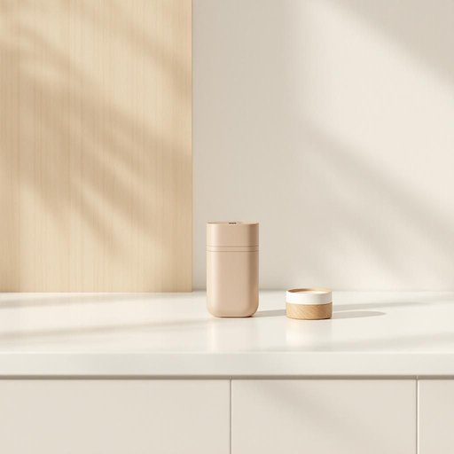

# lighter

<h1 style="font-size: 2.5em; font-weight: 300; letter-spacing: 2px; margin: 0; color: #2c3e50;">
/ˈlaɪtər/
</h1>

---

---

## 例句

Could you please pass me the lighter that’s sitting on the kitchen counter next to the jar of matches, since I want to light the candles on the dining table before our guests arrive and the evening gets any darker?

*Could(/kʊd/) you(/ju/) please(/pliz/) pass(/pæs/) me(/mi/) the(/ðə/) lighter(/ˈlaɪtər/) that’s(/that’s*/) sitting(/ˈsɪtɪŋ/) on(/ɔn/) the(/ðə/) kitchen(/ˈkɪʧən/) counter(/ˈkaʊntər/) next(/nɛkst/) to(/tɪ/) the(/ðə/) jar(/ʤɑr/) of(/əv/) matches,(/ˈmæʧɪz,/) since(/sɪns/) I(/aɪ/) want(/wɔnt/) to(/tɪ/) light(/laɪt/) the(/ðə/) candles(/ˈkændəlz/) on(/ɔn/) the(/ðə/) dining(/ˈdaɪnɪŋ/) table(/ˈteɪbəl/) before(/ˌbiˈfɔr/) our(/ɑr/) guests(/gɛsts/) arrive(/əraɪv/) and(/ənd/) the(/ðə/) evening(/ˈivnɪŋ/) gets(/gɪts/) any(/ˈɛni/) darker?(/ˈdɑrkər?/)*

**翻译：** 你能把放在厨房台面上、火柴罐旁边的打火机递给我吗？我想在客人到来、天色变暗之前点亮餐桌上的蜡烛。

---

## 解释

英语单词“lighter”作为名词在家居生活用品的语境中通常指用来点火的小型便携装置如打火机常见于点燃香烟蜡烛煤气炉或烤炉等场合学习者在使用时需注意区分其作为形容词“轻的”的比较级与名词“打火机”的区别且作为名词时通常不可数变复数形式“lighters”表示多个打火机此外常见搭配有“a lighter for candles”（点蜡烛用的打火机）“pocket lighter”（口袋打火机）等表达使用时需与点火相关的场景结合以免产生歧义词源上“lighter”源于“light”的派生词原意为“点燃者”或“点火器”最早出现于19世纪中期工业革命后随着便携点火装置的发展而广泛使用在中文语境中最准确的翻译为“打火机”它是日常生活中常见的小工具语义中性无明显褒贬或文化色彩但因其涉及点火使用时需注意安全总的来说作为名词的“lighter”在家居生活中是一种实用工具英语学习者应结合具体场景和搭配正确理解和使用

---

<small style="color: #999; font-size: 0.9em;">2025-07-27 09:14:04</small>

