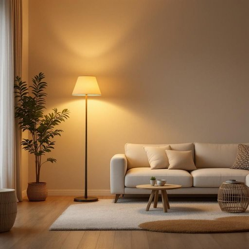

# lighting

<h1 style="font-size: 2.5em; font-weight: 300; letter-spacing: 2px; margin: 0; color: #2c3e50;">
/ˈlaɪtɪŋ/
</h1>

---

---

## 例句

Considering how the lighting in the living room, which combines both the warm glow of the vintage floor lamp and the subtle brilliance of the recessed ceiling lights, can dramatically alter the atmosphere during evening gatherings, it’s worth investing in dimmable bulbs to give us greater control over the mood.

*Considering(/kənˈsɪdərɪŋ/) how(/haʊ/) the(/ðə/) lighting(/ˈlaɪtɪŋ/) in(/ɪn/) the(/ðə/) living(/ˈlɪvɪŋ/) room,(/rum,/) which(/wɪʧ/) combines(/kəmˈbaɪnz/) both(/boʊθ/) the(/ðə/) warm(/wɔrm/) glow(/gloʊ/) of(/əv/) the(/ðə/) vintage(/ˈvɪntɪʤ/) floor(/flɔr/) lamp(/læmp/) and(/ənd/) the(/ðə/) subtle(/ˈsətəl/) brilliance(/ˈbrɪljəns/) of(/əv/) the(/ðə/) recessed(/ˈriˈsɛst/) ceiling(/ˈsilɪŋ/) lights,(/laɪts,/) can(/kən/) dramatically(/drəˈmætɪkəli/) alter(/ˈɔltər/) the(/ðə/) atmosphere(/ˈætməsˌfɪr/) during(/ˈdʊrɪŋ/) evening(/ˈivnɪŋ/) gatherings,(/ˈgæðərɪŋz,/) it’s(/it’s*/) worth(/wərθ/) investing(/ˌɪnˈvɛstɪŋ/) in(/ɪn/) dimmable(/dimmable*/) bulbs(/bəlbz/) to(/tɪ/) give(/gɪv/) us(/ˈjuˈɛs/) greater(/ˈgreɪtər/) control(/kənˈtroʊl/) over(/ˈoʊvər/) the(/ðə/) mood.(/mud./)*

**翻译：** 考虑到客厅灯光的布置，融合了复古落地灯的温暖光晕与嵌入式天花板灯的细腻光辉，晚间聚会时能显著改变氛围，值得投资可调光灯泡，以便更好地掌控整体情调。

---

## 解释

英语单词"lighting"作为名词在家居生活用品场景中，主要指“照明”或“灯具”，即用于室内外空间提供光源的设备及其布置方式。具体使用场合包括描述房间内灯光的设计（如客厅lighting）、选择合适的灯具（如吊灯、台灯）以及讨论灯光效果对居住环境的影响（如柔和lighting营造舒适氛围）。英语学习者需要注意，"lighting"是不可数名词，通常用作整体概念，不能与复数形式连用；常见搭配有"lighting system"（照明系统）、"ambient lighting"（环境照明）、"task lighting"（功能照明）和"natural lighting"（自然光照）。表达时常用"lighting"加介词短语或形容词来具体说明类型或功能。词源方面，"lighting"源自动词"light"（点亮），加上现在分词后缀"-ing"，形成表示“点亮的行为或状态”的名词形式，最初强调动作过程，后来泛指照明设施或整体光源配置。在中文语境中，"lighting"准确翻译为“照明”或“灯具”，强调不仅是灯的实体，更包含其布局和光线效果；需区别于单纯的“灯”或“光”，否则可能引起理解偏差。该词一般中性，无褒贬色彩，但在设计和家居领域常带有提升生活品质、美化环境的积极文化内涵。

---

<small style="color: #999; font-size: 0.9em;">2025-07-27 09:14:04</small>

