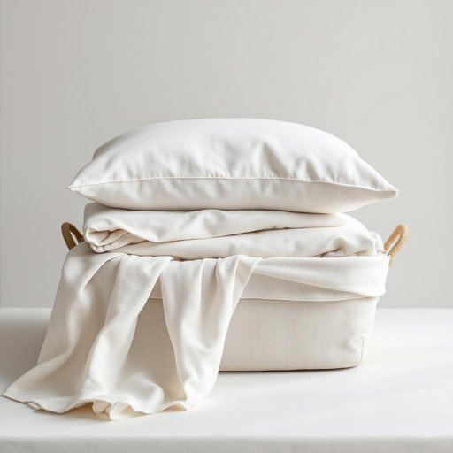

# linen

<h1 style="font-size: 2.5em; font-weight: 300; letter-spacing: 2px; margin: 0; color: #2c3e50;">
/ˈlɪnən/
</h1>

---

---

## 例句

Could you please help me sort out the clean linen from the laundry basket, especially the bedsheets and pillowcases that need ironing before guests arrive later this evening?

*Could(/kʊd/) you(/ju/) please(/pliz/) help(/hɛlp/) me(/mi/) sort(/sɔrt/) out(/aʊt/) the(/ðə/) clean(/klin/) linen(/ˈlɪnən/) from(/frəm/) the(/ðə/) laundry(/ˈlɔndri/) basket,(/ˈbæskət,/) especially(/əˈspɛʃəli/) the(/ðə/) bedsheets(/bedsheets*/) and(/ənd/) pillowcases(/pillowcases*/) that(/ðət/) need(/nid/) ironing(/ˈaɪərnɪŋ/) before(/ˌbiˈfɔr/) guests(/gɛsts/) arrive(/əraɪv/) later(/ˈleɪtər/) this(/ðɪs/) evening?(/ˈivnɪŋ?/)*

**翻译：** 请帮我从洗衣篮中挑出干净的床上用品，特别是那些今晚客人来之前需要熨烫的床单和枕套。

---

## 解释

单词“linen”作为名词在家居生活用品的语境中，主要指用亚麻纤维制成的布料或制品，常见于床单、桌布、餐巾、枕套等织物用品。具体使用场合多见于描述卧室或餐厅的布置，如“change the linen”（更换床单），“table linen”（餐桌布），以及酒店或家居用品商店的商品分类中。在语法上，linen通常作为不可数名词使用，表示一类织物或织物制品，虽偶尔也可表示复数形式“linens”指多件相关布料物品，但较少见，学习者需要注意不要把linen误用为可数名词。常见搭配包括“bed linen”（床上用品），“linen closet”（放置床单等织物的柜子），以及惯用表达“line dry the linen”（晾干亚麻制品）。该词源自拉丁语“linum”，意为亚麻，后来通过古法语传入英语，强调的是以亚麻为原料的天然纺织品。其在中文中的准确翻译通常是“亚麻布”或泛指“织物床单”等家用布料，但在日常用语中多简化为“床上用品”或“亚麻织物”，需根据上下文区别对待。文化上，linen因为其透气性好、耐用且触感舒适，常被视为高品质和优雅生活的象征，在正式和高档家居环境中尤为常见，无明显褒贬含义，但体现了一种天然、环保和健康的生活理念。

---

<small style="color: #999; font-size: 0.9em;">2025-07-27 09:14:04</small>

