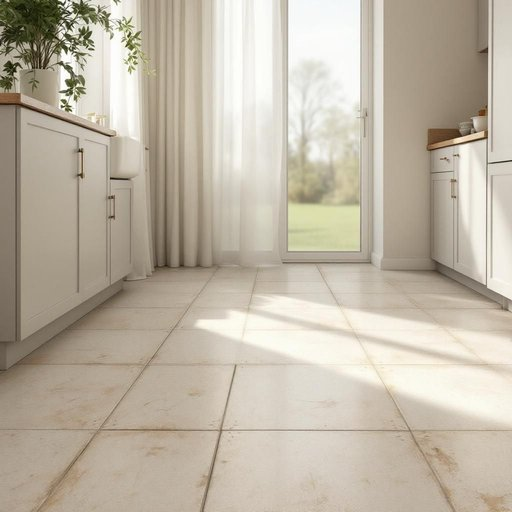

# linoleum

<h1 style="font-size: 2.5em; font-weight: 300; letter-spacing: 2px; margin: 0; color: #2c3e50;">
/ləˈnoʊliəm/
</h1>

---

---

## 例句

Although the kitchen looked charming with its vintage cupboards and quaint floral curtains, I was keen to have the worn-out linoleum replaced, especially because the peeling edges near the sink not only trapped dirt but also made the whole floor feel slippery and unsafe for the kids to run around on rainy afternoons.

*Although(/ˌɔlˈðoʊ/) the(/ðə/) kitchen(/ˈkɪʧən/) looked(/lʊkt/) charming(/ˈʧɑrmɪŋ/) with(/wɪθ/) its(/ɪts/) vintage(/ˈvɪntɪʤ/) cupboards(/ˈkəbərdz/) and(/ənd/) quaint(/kweɪnt/) floral(/ˈflɔrəl/) curtains,(/ˈkərtənz,/) I(/aɪ/) was(/wɑz/) keen(/kin/) to(/tɪ/) have(/hæv/) the(/ðə/) worn-out(/worn-out*/) linoleum(/ləˈnoʊliəm/) replaced,(/ˌriˈpleɪst,/) especially(/əˈspɛʃəli/) because(/bɪˈkəz/) the(/ðə/) peeling(/ˈpilɪŋ/) edges(/ˈɛʤɪz/) near(/nɪr/) the(/ðə/) sink(/sɪŋk/) not(/nɑt/) only(/ˈoʊnli/) trapped(/træpt/) dirt(/dərt/) but(/bət/) also(/ˈɔlsoʊ/) made(/meɪd/) the(/ðə/) whole(/hoʊl/) floor(/flɔr/) feel(/fil/) slippery(/sˈlɪpəri/) and(/ənd/) unsafe(/ənˈseɪf/) for(/fər/) the(/ðə/) kids(/kɪdz/) to(/tɪ/) run(/rən/) around(/əraʊnd/) on(/ɔn/) rainy(/ˈreɪni/) afternoons.(/ˌæftərˈnunz./)*

**翻译：** 虽然厨房因复古的橱柜和别致的花卉窗帘显得格外迷人，但我急切地想更换那已磨损的塑胶地板，尤其是水槽附近剥落的边缘不仅藏污纳垢，还让整块地板显得滑腻不堪，雨天午后孩子们在上面跑跳时极不安全。

---

## 解释

“linoleum”作为名词在家居生活用品场景中指的是一种用于地面的材料，通常为以亚麻油、松脂、木粉和颜料混合后制成的坚韧耐用的防水地板材料，常见于厨房、浴室或走廊等区域，因其维护简单且具有一定弹性而被广泛使用。英语学习者在使用“linoleum”时需注意它是不可数名词，通常不加复数形式，常见搭配有“linoleum floor”（油毡地板）、“lay linoleum”（铺设油毡地板），也可用作形容词构成复合词，如“linoleum tiles”（油毡瓷砖）。其词源来自拉丁语“linum”（亚麻）和希腊语“oleum”（油），反映了其主要成分亚麻油，起源于19世纪中期工业革命期间发明的一种替代木材和瓷砖的地面覆盖材料。在中文语境中，“linoleum”一般被准确翻译为“油毡地板”或简称“油毡”，强调其材质和用途，避免与其他地板材料如“地毯”、“塑胶地板”等混淆。该词通常不含褒贬意义，但在现代家居装修中，油毡地板有时被认为较传统或经济实用，少见于高端装修，因此存在一定的文化内涵，即环境实用性与经济性的体现，而非奢华或时尚的象征。

---

<small style="color: #999; font-size: 0.9em;">2025-07-27 09:14:04</small>

