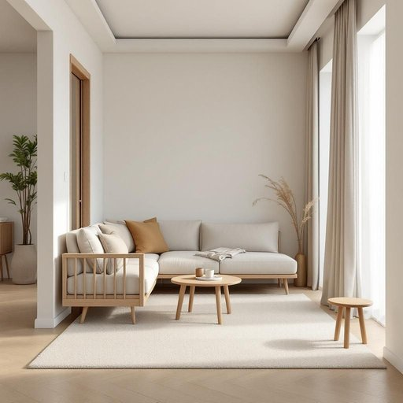

# living

<h1 style="font-size: 2.5em; font-weight: 300; letter-spacing: 2px; margin: 0; color: #2c3e50;">
/ˈlɪvɪŋ/
</h1>

---

---

## 例句

Could you please move the living over to the hallway for now, since the carpet cleaners need full access to the lounge and dining area, and we’ll rearrange everything once they’re done?

*Could(/kʊd/) you(/ju/) please(/pliz/) move(/muv/) the(/ðə/) living(/ˈlɪvɪŋ/) over(/ˈoʊvər/) to(/tɪ/) the(/ðə/) hallway(/ˈhɔlˌweɪ/) for(/fər/) now,(/naʊ,/) since(/sɪns/) the(/ðə/) carpet(/ˈkɑrpət/) cleaners(/ˈklinərz/) need(/nid/) full(/fʊl/) access(/ˈækˌsɛs/) to(/tɪ/) the(/ðə/) lounge(/laʊnʤ/) and(/ənd/) dining(/ˈdaɪnɪŋ/) area,(/ˈɛriə,/) and(/ənd/) we’ll(/we’ll*/) rearrange(/riəreɪnʤ/) everything(/ˈɛvriˌθɪŋ/) once(/wəns/) they’re(/they’re*/) done?(/dən?/)*

**翻译：** 请您暂时将客厅物品移至走廊，因为清洁地毯的工作人员需要完全进入休息室和餐厅区域，待清理完成后我们会重新安排一切。

---

## 解释

英语单词“living”作为名词，尤其在家居生活用品相关的英语场景中，常指“起居室”或“客厅”，这是家庭内部用于日常生活和社交活动的主要房间。具体使用场合多见于描述家居布局、家具配置或空间功能时，如“living room”是固定搭配，单独使用“living”时，通常是非正式或口语中省略了“room”的表达。在语法上，作为名词时“living”多用单数形式，且通常与形容词或限定词连用（例如“the living”，“our living”），需要注意区别其形容词用法（如“living room”中的“living”作为形容词修饰“room”）。常见搭配包括“living space”“living area”等，表达技巧上要明确是在指空间而非生命或生活状态。词源方面，“living”源自于动词“live”的现在分词形式，最初表示“生活的”或“活着的”，后来其名词用法逐渐发展特指“居住区域”，反映了语言中由抽象生命状态向具象居住空间的语义转变。在中文语境中，“living”作为名词多准确翻译为“起居室”或“客厅”，但单独用“living”时不能直接译为“生活”或“生命”，否则会引起误解。此外，该词语色彩中性，无褒贬含义，文化内涵主要关联到家庭日常生活空间与舒适感，是现代居住文化的重要组成部分。

---

<small style="color: #999; font-size: 0.9em;">2025-07-27 09:14:04</small>

