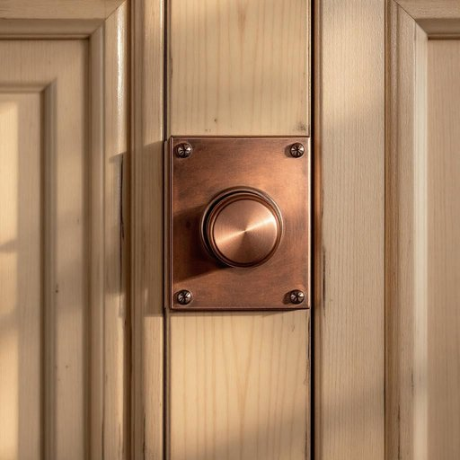

# lock

<h1 style="font-size: 2.5em; font-weight: 300; letter-spacing: 2px; margin: 0; color: #2c3e50;">
/lɑk/
</h1>

---

---

## 例句

Before leaving the house for the weekend, she double-checked that every lock on the doors and windows, especially the old brass lock on the front door that had a tendency to jam, was securely fastened to ensure the security of her belongings.

*Before(/ˌbiˈfɔr/) leaving(/ˈlivɪŋ/) the(/ðə/) house(/haʊs/) for(/fər/) the(/ðə/) weekend,(/ˈwiˌkɪnd,/) she(/ʃi/) double-checked(/double-checked*/) that(/ðət/) every(/ˈɛvəri/) lock(/lɑk/) on(/ɔn/) the(/ðə/) doors(/dɔrz/) and(/ənd/) windows,(/ˈwɪndoʊz,/) especially(/əˈspɛʃəli/) the(/ðə/) old(/oʊld/) brass(/bræs/) lock(/lɑk/) on(/ɔn/) the(/ðə/) front(/frənt/) door(/dɔr/) that(/ðət/) had(/hæd/) a(/ə/) tendency(/ˈtɛndənsi/) to(/tɪ/) jam,(/ʤæm,/) was(/wɑz/) securely(/sɪˈkjʊrli/) fastened(/ˈfæsənd/) to(/tɪ/) ensure(/ɪnˈʃʊr/) the(/ðə/) security(/sɪˈkjʊrəti/) of(/əv/) her(/hər/) belongings.(/bɪˈlɔŋɪŋz./)*

**翻译：** 在周末离家前，她反复确认所有门窗的锁具，尤其是前门上那把容易卡住的旧铜锁，都已牢牢锁好，以确保财物的安全。

---

## 解释

英语单词“lock”作为名词在家居生活用品的语境中，通常指用于门、柜子、抽屉等装置上的锁具，用来防止未经授权的开启以保障安全。例如，门锁（door lock）、安全锁（security lock）等，这些锁能够通过钥匙、密码或机械装置操作，保障财产和隐私安全。英语学习者在使用“lock”作为名词时需注意，它通常是可数名词，复数形式为“locks”，且常与表示所附物体的名词搭配，如“door lock”“window lock”。此外，“lock”也常出现在固定搭配中，如“lock the door”（锁门）、“change the lock”（换锁）等表达。词源方面，“lock”源自古英语“loc”，意指“锁、栓”，最初关联于固定某物不被打开的工具，其含义延续至今。中文语境中，“lock”准确翻译为“锁”，涵盖家居中用于门窗、家具的各种安全装置，强调其防护、固定功能。该词在家居用品领域中不存在褒贬色彩，但在文化上寓意安全、保护和隐私，有时也象征信任与控制。总结而言，“lock”作为家用名词，指具体用于防护门窗或家具的锁具，是确保家庭安全不可或缺的设备。

---

<small style="color: #999; font-size: 0.9em;">2025-07-27 09:14:04</small>

