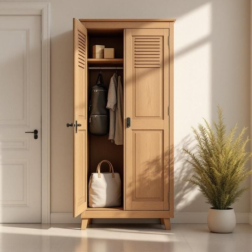

# locker

<h1 style="font-size: 2.5em; font-weight: 300; letter-spacing: 2px; margin: 0; color: #2c3e50;">
/ˈlɑkər/
</h1>

---

---

## 例句

Before leaving for work, she made sure to double-check the locker by the front door, where she habitually stored her gym bag, spare keys, and important parcels, ensuring none of her belongings were misplaced or forgotten in the rush of the morning.

*Before(/ˌbiˈfɔr/) leaving(/ˈlivɪŋ/) for(/fər/) work,(/wərk,/) she(/ʃi/) made(/meɪd/) sure(/ʃʊr/) to(/tɪ/) double-check(/ˈdəbəˌlʧɛk/) the(/ðə/) locker(/ˈlɑkər/) by(/baɪ/) the(/ðə/) front(/frənt/) door,(/dɔr,/) where(/wɛr/) she(/ʃi/) habitually(/həˈbɪʧuəli/) stored(/stɔrd/) her(/hər/) gym(/ʤɪm/) bag,(/bæg,/) spare(/spɛr/) keys,(/kiz,/) and(/ənd/) important(/ˌɪmˈpɔrtənt/) parcels,(/ˈpɑrsəlz,/) ensuring(/ɪnˈʃʊrɪŋ/) none(/nən/) of(/əv/) her(/hər/) belongings(/bɪˈlɔŋɪŋz/) were(/wər/) misplaced(/mɪˈspleɪst/) or(/ər/) forgotten(/fərˈgɑtən/) in(/ɪn/) the(/ðə/) rush(/rəʃ/) of(/əv/) the(/ðə/) morning.(/ˈmɔrnɪŋ./)*

**翻译：** 她出门上班前，特意再次确认了门口的储物柜，那是她习惯放置健身包、备用钥匙和重要包裹的地方，确保在早晨匆忙中没有遗失或忘带任何物品。

---

## 解释

英语单词“locker”作为名词在家居生活用品语境中通常指一种带锁的小柜子，用于存放个人物品以确保安全和私密，常见于学校、健身房、更衣室或办公室，也可以出现在家庭中，用于储存重要或私人物品。使用“locker”时，英语学习者应注意它通常是可数名词，复数形式为“lockers”，并常与介词短语搭配使用，如“in the locker”（在储物柜里）、“put something in the locker”（把某物放进储物柜）。此外，常见搭配还包括“locker room”（更衣室）和“locker key”（储物柜钥匙）。词源方面，“locker”源自动词“lock”，加上名词后缀“-er”，原意即为“可以锁的物品”，最早用于描述带锁的储物柜，体现其安全保管的功能。在中文语境中，“locker”准确翻译为“储物柜”或“带锁的柜子”，侧重于其安全存放个人物品的特点，并无褒贬色彩，属于中性词汇，但在不同文化背景下，储物柜的设计和使用场合可能有所区别，英语中“locker”一词更多强调其便于公共或半公共场所管理和安全存放的属性。

---

<small style="color: #999; font-size: 0.9em;">2025-07-27 09:14:04</small>

