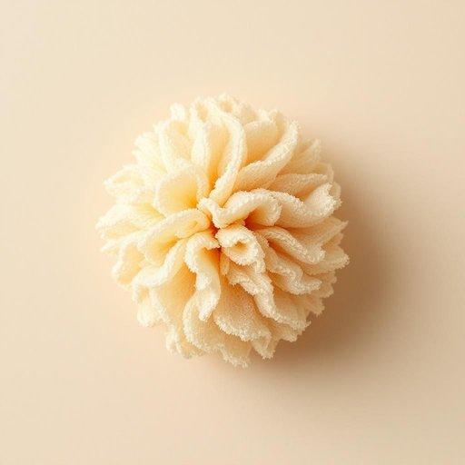

# loofah

<h1 style="font-size: 2.5em; font-weight: 300; letter-spacing: 2px; margin: 0; color: #2c3e50;">
/loofah*/
</h1>

---

---

## 例句

After discovering that the loofah, which she had bought last month for exfoliating purposes, was starting to fray and lose its firmness, Julia decided to replace it with a natural sea sponge, reasoning that it would be gentler on her sensitive skin while still providing the invigorating scrub she preferred during her morning shower routine.

*After(/ˈæftər/) discovering(/dɪˈskəvərɪŋ/) that(/ðət/) the(/ðə/) loofah,(/loofah*,/) which(/wɪʧ/) she(/ʃi/) had(/hæd/) bought(/bɔt/) last(/læst/) month(/mənθ/) for(/fər/) exfoliating(/exfoliating*/) purposes,(/ˈpərpəsɪz,/) was(/wɑz/) starting(/ˈstɑrtɪŋ/) to(/tɪ/) fray(/freɪ/) and(/ənd/) lose(/luz/) its(/ɪts/) firmness,(/ˈfərmnəs,/) Julia(/ˈʤuljə/) decided(/ˌdɪˈsaɪdɪd/) to(/tɪ/) replace(/ˌriˈpleɪs/) it(/ɪt/) with(/wɪθ/) a(/ə/) natural(/ˈnæʧərəl/) sea(/si/) sponge,(/spənʤ,/) reasoning(/ˈrizənɪŋ/) that(/ðət/) it(/ɪt/) would(/wʊd/) be(/bi/) gentler(/ˈʤɛntlər/) on(/ɔn/) her(/hər/) sensitive(/ˈsɛnsɪtɪv/) skin(/skɪn/) while(/waɪl/) still(/stɪl/) providing(/prəˈvaɪdɪŋ/) the(/ðə/) invigorating(/ˌɪnˈvɪgərˌeɪtɪŋ/) scrub(/skrəb/) she(/ʃi/) preferred(/prɪˈfərd/) during(/ˈdʊrɪŋ/) her(/hər/) morning(/ˈmɔrnɪŋ/) shower(/ʃaʊər/) routine.(/ruˈtin./)*

**翻译：** 在发现她上个月购买用来去角质的丝瓜络开始磨损且失去弹性后，茱莉亚决定用天然海绵替代，认为它对她敏感的皮肤更为温和，同时仍能在晨浴时提供她喜爱的提神按摩效果。

---

## 解释

单词“loofah”在家居生活用品的语境中，作为名词通常指一种天然植物纤维制成的浴用海绵，用来擦洗皮肤，帮助去除角质和促进血液循环，常见于洗澡或沐浴时使用。英语学习者在使用“loofah”时应注意它作可数名词，复数形式为“loofahs”，且常与“bath,” “shower,” “scrubber,” “sponge”等词搭配使用，如“a loofah sponge”或“use a loofah to exfoliate”。此外，虽然“loofah”本身无褒贬色彩，但有时因材质天然和环保特点，在日常交流中带有积极健康生活的文化内涵。该词源自阿拉伯语“luff”或“lufa”，最初指一种属于葫芦科的植物，经过干燥后其内部形成的纤维网状结构被广泛用作清洁用品和厨房用具吸水海绵。中文中“loofah”准确译为“丝瓜络”或“丝瓜海绵”，是天然的丝瓜干燥后形成的海绵状纤维，区别于合成材质的浴擦。理解这一词汇时，需结合其天然材质特性和实际用途，以便正确理解其在家居生活中的功能和文化价值。

---

<small style="color: #999; font-size: 0.9em;">2025-07-27 09:14:04</small>

