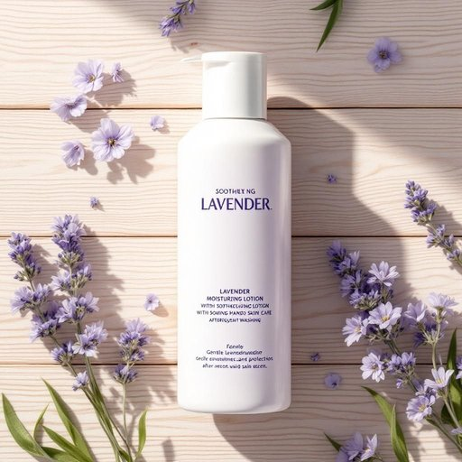

# lotion

<h1 style="font-size: 2.5em; font-weight: 300; letter-spacing: 2px; margin: 0; color: #2c3e50;">
/ˈloʊʃən/
</h1>

---

---

## 例句

Before you head to bed, the lotion’s soothing lavender scent provided a much-needed contrast to the dryness caused by frequent hand washing, offering a remarkable remedy for skin in desperate need of moisturizing care.

*Before(/ˌbiˈfɔr/) you(/ju/) head(/hɛd/) to(/tɪ/) bed,(/bɛd,/) the(/ðə/) lotion’s(/lotion’s*/) soothing(/ˈsuðɪŋ/) lavender(/ˈlævəndər/) scent(/sɛnt/) provided(/prəˈvaɪdɪd/) a(/ə/) much-needed(/much-needed*/) contrast(/ˈkɑntræst/) to(/tɪ/) the(/ðə/) dryness(/ˈdraɪnəs/) caused(/kɔzd/) by(/baɪ/) frequent(/ˈfrikˌwɛnt/) hand(/hænd/) washing,(/ˈwɑʃɪŋ,/) offering(/ˈɔfərɪŋ/) a(/ə/) remarkable(/rɪˈmɑrkəbəl/) remedy(/ˈrɛmədi/) for(/fər/) skin(/skɪn/) in(/ɪn/) desperate(/ˈdɛspərɪt/) need(/nid/) of(/əv/) moisturizing(/moisturizing*/) care.(/kɛr./)*

**翻译：** 在你准备入睡之前，这款乳液那令人舒缓的薰衣草香气，为因频繁洗手而带来的干燥感带来了急需的反差，成为肌肤亟需保湿呵护时的绝佳良方。

---

## 解释

英语单词“lotion”作为名词在家居生活用品语境中指的是一种外用液体，通常为乳状或稀薄的膏状物质，主要用于护肤、保湿、防晒或舒缓肌肤等用途，常见于浴室或卧室中使用场合，如洗澡后涂抹以滋润皮肤。使用时，英语学习者需注意“lotion”通常不可数，但在特定语境中也可作为可数名词使用，如“一瓶lotion（a bottle of lotion）”，且常与介词“for”搭配来说明用途，例如果肤“moisturizing lotion for dry skin”。另外，“lotion”与“cream”、“ointment”之类的词汇区别较为细微，前者多为液体，后者则较为浓稠。词源方面，“lotion”源自拉丁语“lotio”，意为洗涤，经过古法语“lotion”传入英语，体现其原初作为涂抹或清洗用途的背景。在中文语境中，“lotion”常被译为“乳液”或“润肤露”，强调其温和、滋润的特点，不能简单等同于“药膏”或“软膏”，后者含医疗属性。该词本身无贬义或褒义，属于中性词汇，文化上常关联到个人护理和美容保养，但并不隐含特殊社会或文化色彩。

---

<small style="color: #999; font-size: 0.9em;">2025-07-27 09:14:04</small>

