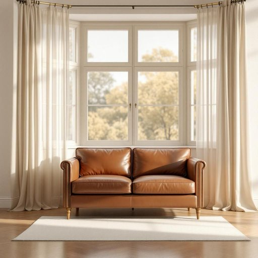

# loveseat

<h1 style="font-size: 2.5em; font-weight: 300; letter-spacing: 2px; margin: 0; color: #2c3e50;">
/loveseat*/
</h1>

---

---

## 例句

After debating for hours whether to replace the old, worn-out sofa with a larger sectional or opt for something cozier, we finally decided that a vintage leather loveseat, which not only fits perfectly under the bay window but also adds a charming touch to our living room’s eclectic décor, would be the ideal choice for quiet evenings spent reading or enjoying coffee together.

*After(/ˈæftər/) debating(/dəˈbeɪtɪŋ/) for(/fər/) hours(/aʊərz/) whether(/ˈwɛðər/) to(/tɪ/) replace(/ˌriˈpleɪs/) the(/ðə/) old,(/oʊld,/) worn-out(/worn-out*/) sofa(/ˈsoʊfə/) with(/wɪθ/) a(/ə/) larger(/ˈlɑrʤər/) sectional(/ˈsɛkʃənəl/) or(/ər/) opt(/ɑpt/) for(/fər/) something(/ˈsəmθɪŋ/) cozier,(/ˈkoʊziər,/) we(/wi/) finally(/ˈfaɪnəli/) decided(/ˌdɪˈsaɪdɪd/) that(/ðət/) a(/ə/) vintage(/ˈvɪntɪʤ/) leather(/ˈlɛðər/) loveseat,(/loveseat*,/) which(/wɪʧ/) not(/nɑt/) only(/ˈoʊnli/) fits(/fɪts/) perfectly(/ˈpərfəktli/) under(/ˈəndər/) the(/ðə/) bay(/beɪ/) window(/ˈwɪndoʊ/) but(/bət/) also(/ˈɔlsoʊ/) adds(/ædz/) a(/ə/) charming(/ˈʧɑrmɪŋ/) touch(/təʧ/) to(/tɪ/) our(/ɑr/) living(/ˈlɪvɪŋ/) room’s(/room’s*/) eclectic(/ɪˈklɛktɪk/) décor,(/décor*,/) would(/wʊd/) be(/bi/) the(/ðə/) ideal(/aɪˈdil/) choice(/ʧɔɪs/) for(/fər/) quiet(/kwaɪət/) evenings(/ˈivnɪŋz/) spent(/spɛnt/) reading(/ˈrɛdɪŋ/) or(/ər/) enjoying(/ˌɛnˈʤɔɪɪŋ/) coffee(/ˈkɔfi/) together.(/təˈgɛðər./)*

**翻译：** 经过数小时的讨论，关于是用更大的组合沙发代替旧且破旧的沙发，还是选择更舒适的款式，我们最终决定选一款复古皮质双人沙发。这款沙发不仅能完美置于飘窗下，还为客厅的折衷装饰增添了一抹别致，是在静谧的夜晚读书或共饮咖啡的理想之选。

---

## 解释

loveseat作为名词，在家居生活用品的语境中指的是一种专为两个人设计的小型双人沙发，通常尺寸比普通沙发略小，适合放置在客厅、书房或卧室，用于提供亲密、舒适的座位空间。英语学习者在使用这个单词时应注意其单数和复数形式（loveseat与loveseats），以及常见搭配如“a comfortable loveseat”（一张舒适的双人沙发）、“sit on the loveseat”（坐在双人沙发上）等，表达时要结合具体语境避免误用，特别是在描述家具时，不能简单理解为“情人座椅”或带有强烈感情色彩的词汇。该词的词源来自love（爱）和seat（座位）的组合，最初设计理念是强调情侣或亲密朋友之间共享一个座位的温馨感，起源于18至19世纪欧洲贵族或上层社会中小型家具的流行。中文语境中，loveseat一般翻译为“双人小沙发”或“情侣沙发”，准确反映其双人且尺寸较小的特征，不宜直译为“情人座”以免产生不必要的联想。虽然带有一定的浪漫色彩，但更多是一种家具名称，没有明显褒贬含义，属于中性词汇，适合在家居设计、家具销售及生活场景中使用。

---

<small style="color: #999; font-size: 0.9em;">2025-07-27 09:14:04</small>

