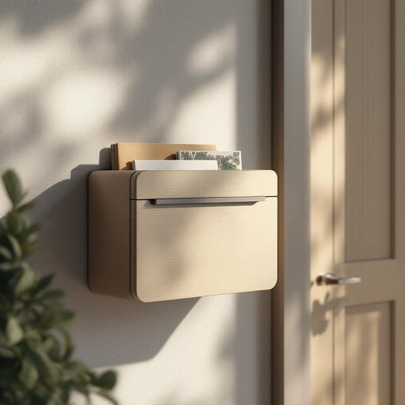

# mailbox

<h1 style="font-size: 2.5em; font-weight: 300; letter-spacing: 2px; margin: 0; color: #2c3e50;">
/ˈmeɪlˌbɑks/
</h1>

---

---

## 例句

Every morning, before heading to work, I make sure to check the mailbox by the front gate, which is often overflowing with letters, parcels, and occasionally the weekly gardening magazine that my neighbour kindly drops off when I’m away.

*Every(/ˈɛvəri/) morning,(/ˈmɔrnɪŋ,/) before(/ˌbiˈfɔr/) heading(/ˈhɛdɪŋ/) to(/tɪ/) work,(/wərk,/) I(/aɪ/) make(/meɪk/) sure(/ʃʊr/) to(/tɪ/) check(/ʧɛk/) the(/ðə/) mailbox(/ˈmeɪlˌbɑks/) by(/baɪ/) the(/ðə/) front(/frənt/) gate,(/geɪt,/) which(/wɪʧ/) is(/ɪz/) often(/ˈɔfən/) overflowing(/ˈoʊvərˌfloʊɪŋ/) with(/wɪθ/) letters,(/ˈlɛtərz,/) parcels,(/ˈpɑrsəlz,/) and(/ənd/) occasionally(/ɔˈkeɪʒənəˌli/) the(/ðə/) weekly(/ˈwikli/) gardening(/ˈgɑrdənɪŋ/) magazine(/ˈmægəˌzin/) that(/ðət/) my(/maɪ/) neighbour(/ˈneɪbər/) kindly(/ˈkaɪndli/) drops(/drɑps/) off(/ɔf/) when(/wɪn/) I’m(/i’m*/) away.(/əˈweɪ./)*

**翻译：** 每天早晨，出门上班前，我都会去前门的信箱查看，那里常常堆满了信件、包裹，偶尔还有我不在时邻居好心送来的每周园艺杂志。

---

## 解释

英语单词“mailbox”作为名词，主要指的是住宅或建筑物外用于接收邮递员投递信件和包裹的专用容器，通常是一个小箱子或开口口袋，安装在门口、围栏或墙壁上，在家居生活用品的语境中属常见物件。使用“mailbox”时，学习者应注意其复数形式为“mailboxes”，且常与介词搭配使用，如“at the mailbox”（在邮箱处）、“check the mailbox”（查看邮箱），此外还有相关短语如“mailbox key”（邮箱钥匙）和“empty the mailbox”（清空邮箱）等。该词由“mail”（邮件）和“box”（箱子）组合而成，源自19世纪邮政服务普及后为方便收取邮件而设计的收件装置，是复合词的一种，最初用于指邮局或邮递点的邮件收纳箱，后逐渐引申到私人住宅使用的邮件收取箱。在中文语境中，“mailbox”准确翻译为“邮箱”或“信箱”，含义明确指家中用于收信的固定装置，无特殊褒贬色彩，属于中性词汇，且在现代日常生活中极为普遍和实用，因此掌握该词有助于理解和描述家庭生活相关的物品及邮政活动。

---

<small style="color: #999; font-size: 0.9em;">2025-07-27 09:14:04</small>

