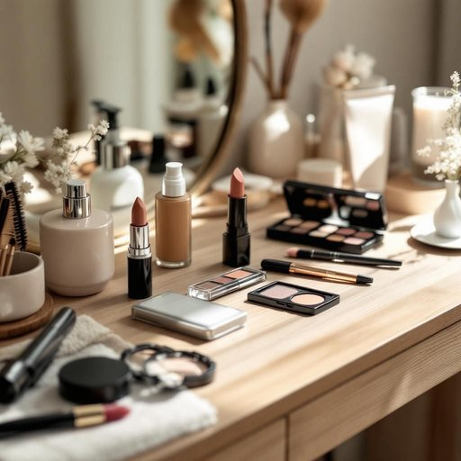

# makeup

<h1 style="font-size: 2.5em; font-weight: 300; letter-spacing: 2px; margin: 0; color: #2c3e50;">
/ˈmeɪˌkəp/
</h1>

---

---

## 例句

Before heading out to the party, she carefully arranged her makeup, including foundation, eyeshadow, and lipstick, on the cluttered dressing table that was already crowded with skincare products and hair accessories, making sure everything was perfectly within reach to touch up if needed later in the evening.

*Before(/ˌbiˈfɔr/) heading(/ˈhɛdɪŋ/) out(/aʊt/) to(/tɪ/) the(/ðə/) party,(/ˈpɑrti,/) she(/ʃi/) carefully(/ˈkɛrfəli/) arranged(/əreɪnʤd/) her(/hər/) makeup,(/ˈmeɪˌkəp,/) including(/ˌɪnˈkludɪŋ/) foundation,(/faʊnˈdeɪʃən,/) eyeshadow,(/eyeshadow*,/) and(/ənd/) lipstick,(/ˈlɪpˌstɪk,/) on(/ɔn/) the(/ðə/) cluttered(/ˈklətərd/) dressing(/ˈdrɛsɪŋ/) table(/ˈteɪbəl/) that(/ðət/) was(/wɑz/) already(/ɔˈrɛdi/) crowded(/ˈkraʊdɪd/) with(/wɪθ/) skincare(/skincare*/) products(/ˈprɑdəkts/) and(/ənd/) hair(/hɛr/) accessories,(/ækˈsɛsəriz,/) making(/ˈmeɪkɪŋ/) sure(/ʃʊr/) everything(/ˈɛvriˌθɪŋ/) was(/wɑz/) perfectly(/ˈpərfəktli/) within(/wɪˈθɪn/) reach(/riʧ/) to(/tɪ/) touch(/təʧ/) up(/əp/) if(/ɪf/) needed(/ˈnidɪd/) later(/ˈleɪtər/) in(/ɪn/) the(/ðə/) evening.(/ˈivnɪŋ./)*

**翻译：** 在出发去参加派对之前，她仔细地整理了妆容，包括粉底、眼影和口红，这些都摆放在已经堆满护肤品和发饰的凌乱梳妆台上，确保一切都触手可及，以便晚上需要时随时补妆。

---

## 解释

单词“makeup”在家居生活用品的语境中作为名词，通常指“化妆品”，即用于装饰或者修饰面部的各类产品，如粉底、口红、眼影等。具体使用场合一般包括购买、使用、存放化妆品时的对话或描述，比如“Her makeup is on the dressing table”（她的化妆品放在梳妆台上）或者“store your makeup properly to avoid spoilage”（妥善保存化妆品以防变质）。英语学习者在使用“makeup”作名词时需要注意它是不可数名词，通常不加复数形式，且常与表示具体种类的词连用，如“a makeup kit”（化妆盒）、“makeup remover”（卸妆水）；同时，“makeup”也可以作为复合词的一部分出现，如“makeup brush”（化妆刷）。在语法上，它常作主语、宾语或表语。在词源方面，“makeup”由“make”（制造、构成）和“up”（向上）组成，原意指“构成、组成”，后来引申为“化妆”，即通过某种方式使外貌“构成”或“完成”。在中文语境中，“makeup”准确翻译为“化妆品”，强调其作为日常生活用品的实用功能，没有褒贬色彩，属于中性词汇，但在某些文化背景下，化妆品使用与否可能涉及个人形象、审美观念和社会期待，需结合具体语境理解。

---

<small style="color: #999; font-size: 0.9em;">2025-07-27 09:14:04</small>

