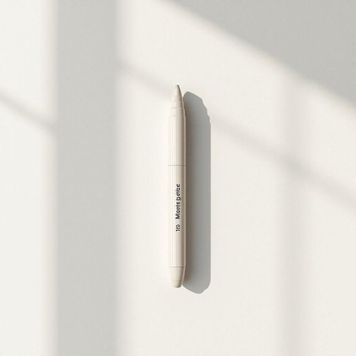

# marker

<h1 style="font-size: 2.5em; font-weight: 300; letter-spacing: 2px; margin: 0; color: #2c3e50;">
/ˈmɑrkər/
</h1>

---

---

## 例句

The research on climate change, which is permanently altering weather patterns worldwide, highlights the urgent need for sustainable solutions that can mitigate its devastating effects on ecosystems and human communities.

*The(/ðə/) research(/ˈrisərʧ/) on(/ɔn/) climate(/ˈklaɪmɪt/) change,(/ʧeɪnʤ,/) which(/wɪʧ/) is(/ɪz/) permanently(/ˈpərmɑˌnɛnˌtli/) altering(/ˈɔltərɪŋ/) weather(/ˈwɛðər/) patterns(/ˈpætərnz/) worldwide,(/ˈwərldˈwaɪd,/) highlights(/ˈhaɪˌlaɪts/) the(/ðə/) urgent(/ˈərʤənt/) need(/nid/) for(/fər/) sustainable(/səˈsteɪnəbəl/) solutions(/səˈluʃənz/) that(/ðət/) can(/kən/) mitigate(/ˈmɪtəˌgeɪt/) its(/ɪts/) devastating(/ˈdɛvəˌsteɪtɪŋ/) effects(/ˈifɛkts/) on(/ɔn/) ecosystems(/ˈikoʊˌsɪstəmz/) and(/ənd/) human(/ˈjumən/) communities.(/kəmˈjunɪtiz./)*

**翻译：** 气候变化的研究表明，气候变化正在全球范围内持续改变天气模式，凸显了迫切需要可持续解决方案，以减缓其对生态系统和人类社会的毁灭性影响。

---

## 解释

在家居生活用品的语境中，英语单词“marker”作为名词通常指的是用于书写、标记或绘画的笔类工具，如记号笔、荧光笔、白板笔等，具体使用场合多为在家里给物品做标记、在白板或纸张上书写或进行创意绘画。英语学习者在使用“marker”时应注意其不可数与可数形式的区别，通常表示单支具体的笔时为可数名词（a marker, two markers），而泛指这类文具时可用复数形式；此外，“marker”常与颜色、用途等词搭配，如“permanent marker”（永久性记号笔）、“highlighter marker”（荧光笔），还有“marker pen”也是常见表达。词源上，“marker”来源于英语动词“mark”（标记、做记号）加上名词后缀“-er”，表示执行动作的人或物，引申为用来做标记的工具。中文语境中，“marker”通常翻译为“记号笔”、“马克笔”或“标记笔”，具体翻译依其功能和材质而定，理解上强调其可用于在各种表面上留下字迹或记号的工具。此词本身中性无褒贬或特殊文化色彩，属于生活日常用品的常用名词。

---

<small style="color: #999; font-size: 0.9em;">2025-07-27 09:14:04</small>

