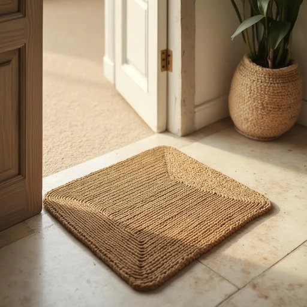

# mat

<h1 style="font-size: 2.5em; font-weight: 300; letter-spacing: 2px; margin: 0; color: #2c3e50;">
/mæt/
</h1>

---

---

## 例句

Before stepping inside the house, could you please wipe your muddy boots thoroughly on the woven coir mat placed by the door, which not only helps keep the hallway clean but also adds a charming rustic touch to our cosy living room?

*Before(/ˌbiˈfɔr/) stepping(/ˈstɛpɪŋ/) inside(/ˌɪnˈsaɪd/) the(/ðə/) house,(/haʊs,/) could(/kʊd/) you(/ju/) please(/pliz/) wipe(/waɪp/) your(/jʊr/) muddy(/ˈmədi/) boots(/buts/) thoroughly(/ˈθəroʊli/) on(/ɔn/) the(/ðə/) woven(/ˈwoʊvən/) coir(/coir*/) mat(/mæt/) placed(/pleɪst/) by(/baɪ/) the(/ðə/) door,(/dɔr,/) which(/wɪʧ/) not(/nɑt/) only(/ˈoʊnli/) helps(/hɛlps/) keep(/kip/) the(/ðə/) hallway(/ˈhɔlˌweɪ/) clean(/klin/) but(/bət/) also(/ˈɔlsoʊ/) adds(/ædz/) a(/ə/) charming(/ˈʧɑrmɪŋ/) rustic(/ˈrəstɪk/) touch(/təʧ/) to(/tɪ/) our(/ɑr/) cosy(/ˈkoʊzi/) living(/ˈlɪvɪŋ/) room?(/rum?/)*

**翻译：** 在进入屋内之前，请务必在门口放置的编织椰壳垫上仔细擦拭泥泞的靴子，这不仅有助于保持走廊的整洁，也为我们的客厅增添了一抹迷人的乡村韵味。

---

## 解释

英语单词“mat”作为名词，在家居生活用品语境中通常指放置在门口、地板或特定区域用来擦鞋、防滑或装饰的小块垫子。具体使用场合包括门厅门口的门垫、厨房或浴室地面的防滑垫，甚至宠物窝下用的垫子等。英语学习者在使用“mat”时需注意其单复数形式“mat/mats”，且通常作为可数名词使用，常见搭配有“door mat”（门垫）、“bath mat”（浴室垫）、“welcome mat”（欢迎垫），表达时也可结合形容词修饰，如“rubber mat”（橡胶垫）、“floor mat”（地垫）。词源上，“mat”源自古英语“mætt”，意指用草、麻或其他植物材料编织的垫子，反映了其传统制作工艺和实用功能。在中文语境中，“mat”准确翻译为“垫子”或“门垫”，需根据具体场景区分，如放门口的称“门垫”，放浴室的称“浴室垫”等，突出其实用性和位置属性。该词本身无明显褒贬色彩，属于中性词，文化内涵主要体现在家居生活的整洁与舒适需求，凸显一种实用且细致的生活态度。

---

<small style="color: #999; font-size: 0.9em;">2025-07-27 09:14:04</small>

