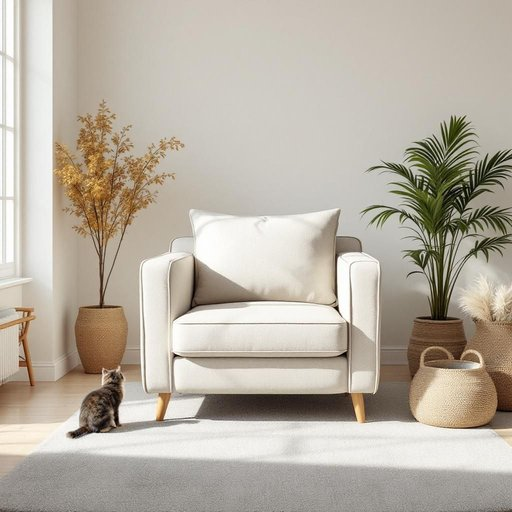

# material

<h1 style="font-size: 2.5em; font-weight: 300; letter-spacing: 2px; margin: 0; color: #2c3e50;">
/məˈtɪriəl/
</h1>

---

---

## 例句

Considering the durability of the old armchair, I am thinking of reupholstering it with a material that not only complements the living room’s colour scheme but is also easy to clean, especially since we have two young children and a mischievous cat.

*Considering(/kənˈsɪdərɪŋ/) the(/ðə/) durability(/dərəˈbɪlɪti/) of(/əv/) the(/ðə/) old(/oʊld/) armchair,(/ˈɑrmˌʧɛr,/) I(/aɪ/) am(/æm/) thinking(/ˈθɪŋkɪŋ/) of(/əv/) reupholstering(/reupholstering*/) it(/ɪt/) with(/wɪθ/) a(/ə/) material(/məˈtɪriəl/) that(/ðət/) not(/nɑt/) only(/ˈoʊnli/) complements(/ˈkɑmpləmənts/) the(/ðə/) living(/ˈlɪvɪŋ/) room’s(/room’s*/) colour(/ˈkələr/) scheme(/skim/) but(/bət/) is(/ɪz/) also(/ˈɔlsoʊ/) easy(/ˈizi/) to(/tɪ/) clean,(/klin,/) especially(/əˈspɛʃəli/) since(/sɪns/) we(/wi/) have(/hæv/) two(/tu/) young(/jəŋ/) children(/ˈʧɪldrən/) and(/ənd/) a(/ə/) mischievous(/ˈmɪsʧəvəs/) cat.(/kæt./)*

**翻译：** 考虑到这把旧扶手椅的耐用性，我打算用一种不仅能与客厅色彩协调、而且易于清洁的面料重新包覆，尤其是因为我们家有两个年幼的孩子和一只调皮的猫。

---

## 解释

在家居生活用品的语境中，英语单词“material”作为名词主要指构成某种物品的“材料”或“原料”，例如家具的布料、地毯的织物、厨房用具的塑料或金属等。具体使用时，常见语境包括描述物品的质地和成分，如“This sofa is made of high-quality material”（这张沙发由高质量材料制成）或者“Choose a waterproof material for kitchen mats”（为厨房垫选择防水材料）。英语学习者在使用“material”时需注意其不可数名词性质，通常不用复数形式materials时表示“材料”的整体概念，但在指多种不同种类时可用复数形式；此外，常见搭配有“raw material”（原材料）、“fabric material”（织物材料）、“building materials”（建筑材料）等。表达时可通过形容词如“durable”，“lightweight”修饰以具体说明材料特性。词源方面，“material”源自拉丁语“materialis”，与“materia”（物质、材料）相关，强调构成物体的物质基础，体现出其本质的物理属性。在中文语境中，“material”准确翻译为“材料”或“物料”，强调的是物品制造或构成的实体元素，通常无特殊褒贬含义，属于中性词汇。需要留意的是，虽“material”多指实物材料，但在其他语境下（如“study material”学习资料）意思有所不同，故家居用品领域应特别聚焦于物质材料这一涵义。总体而言，“material”作为名词是描述生活用品本质特性的核心词汇，准确理解其语法用法及搭配，有助于表达物品属性和选购建议。

---

<small style="color: #999; font-size: 0.9em;">2025-07-27 09:14:04</small>

