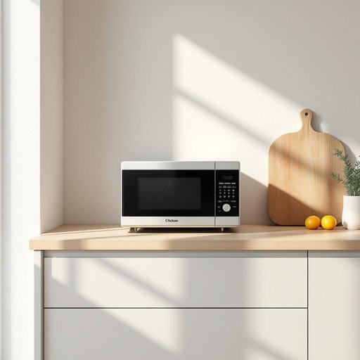

# microwave

<h1 style="font-size: 2.5em; font-weight: 300; letter-spacing: 2px; margin: 0; color: #2c3e50;">
/ˈmaɪkrəˌweɪv/
</h1>

---

---

## 例句

Could you please warm up the leftovers in the microwave before we sit down for dinner, ensuring that the meal is piping hot and ready to be served alongside the fresh salad and crusty bread I just prepared?

*Could(/kʊd/) you(/ju/) please(/pliz/) warm(/wɔrm/) up(/əp/) the(/ðə/) leftovers(/ˈlɛfˌtoʊvərz/) in(/ɪn/) the(/ðə/) microwave(/ˈmaɪkrəˌweɪv/) before(/ˌbiˈfɔr/) we(/wi/) sit(/sɪt/) down(/daʊn/) for(/fər/) dinner,(/ˈdɪnər,/) ensuring(/ɪnˈʃʊrɪŋ/) that(/ðət/) the(/ðə/) meal(/mil/) is(/ɪz/) piping(/ˈpaɪpɪŋ/) hot(/hɑt/) and(/ənd/) ready(/ˈrɛdi/) to(/tɪ/) be(/bi/) served(/sərvd/) alongside(/əˈlɔŋˈsaɪd/) the(/ðə/) fresh(/frɛʃ/) salad(/ˈsæləd/) and(/ənd/) crusty(/ˈkrəsti/) bread(/brɛd/) I(/aɪ/) just(/ʤɪst/) prepared?(/priˈpɛrd?/)*

**翻译：** 在我们坐下来吃晚饭之前，请你用微波炉把剩菜加热一下，确保饭菜热气腾腾，可以与我刚准备的新鲜沙拉和酥脆面包一同享用。

---

## 解释

英语单词“microwave”作为名词在家居生活用品场景中指的是“微波炉”，一种利用微波辐射加热食物的小家电。它通常出现在厨房环境，使用者将食物放入微波炉内，设定时间后快速加热或解冻，适合快节奏生活中快速准备餐食。英语学习者在使用“microwave”时应注意，它可以直接用作名词，也常见作动词（to microwave），表示用微波炉加热，动词用法时常搭配宾语，如“microwave dinner”（用微波炉加热晚餐）。此外，“microwave oven”是其全称，但日常多简称为“microwave”。语法上，作为名词时属于可数名词，复数形式为“microwaves”。词源上，“microwave”源自“micro-”表示“微小的”与“wave”表示“波”，指波长极短的电磁波，微波炉利用这种波长的电磁波加热食物。中文语境中，“microwave”准确翻译为“微波炉”，强调其使用微波技术的特点，无贬义或特别褒义，属于中性词汇，广泛普及，是现代家庭厨房的重要电器之一。总的来说，“microwave”在家居语境中指代便捷、快速的加热工具，学习时需明确其名词与动词用法及日常搭配，理解其科学技术背景及在中文中的标准译法，避免误用。

---

<small style="color: #999; font-size: 0.9em;">2025-07-27 09:14:04</small>

