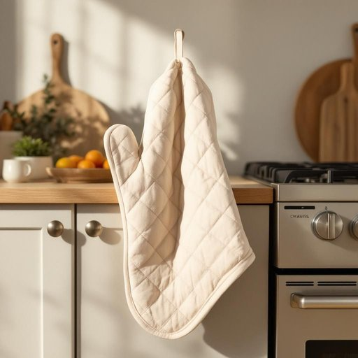

# mitt

<h1 style="font-size: 2.5em; font-weight: 300; letter-spacing: 2px; margin: 0; color: #2c3e50;">
/mɪt/
</h1>

---

---

## 例句

After accidentally burning my hand on the oven tray, I quickly grabbed the thick, quilted mitt that’s usually hanging by the stove, which not only protected me from further injury but also reminded me to always keep one nearby whenever I’m baking or handling hot cookware in the kitchen.

*After(/ˈæftər/) accidentally(/ˌæksəˈdɛnəli/) burning(/ˈbərnɪŋ/) my(/maɪ/) hand(/hænd/) on(/ɔn/) the(/ðə/) oven(/ˈəvən/) tray,(/treɪ,/) I(/aɪ/) quickly(/kˈwɪkli/) grabbed(/græbd/) the(/ðə/) thick,(/θɪk,/) quilted(/kˈwɪltɪd/) mitt(/mɪt/) that’s(/that’s*/) usually(/ˈjuʒəwəli/) hanging(/ˈhæŋɪŋ/) by(/baɪ/) the(/ðə/) stove,(/stoʊv,/) which(/wɪʧ/) not(/nɑt/) only(/ˈoʊnli/) protected(/prəˈtɛktɪd/) me(/mi/) from(/frəm/) further(/ˈfərðər/) injury(/ˈɪnʤəri/) but(/bət/) also(/ˈɔlsoʊ/) reminded(/riˈmaɪndɪd/) me(/mi/) to(/tɪ/) always(/ˈɔlˌweɪz/) keep(/kip/) one(/wən/) nearby(/ˈnɪrˈbaɪ/) whenever(/wɛˈnɛvər/) I’m(/i’m*/) baking(/ˈbeɪkɪŋ/) or(/ər/) handling(/ˈhændəlɪŋ/) hot(/hɑt/) cookware(/ˈkʊkˌwɛr/) in(/ɪn/) the(/ðə/) kitchen.(/ˈkɪʧən./)*

**翻译：** 不小心被烤盘烫伤后，我迅速抓起通常挂在炉灶旁的厚实绗缝手套，它不仅保护我免受进一步伤害，还提醒我每次烘焙或操作热锅具时，都要随手备一只。

---

## 解释

英语单词mitt作为名词在家居生活用品场景中通常指锅套或烤箱手套，是一种保护手部免受高温烫伤的帕状或手套状用品，常用于厨房操作中拿取烤箱内的热器具或热锅，具体使用场合多为厨房活动，如烹饪时取放烤盘、锅具，以及处理刚煮熟的食物时需防止烫伤的情境。英语学习者在使用mitt时应注意其词性为名词，通常搭配形容词如oven mitt（烤箱手套）、hot mitt等，用法上多以单数或复数形式出现，如Put on an oven mitt before taking out the tray.，且一般表达的是实物，不能引申为抽象含义。此外，mitt也常见于体育用品中指棒球手套，但在家居用品语境中应区别开来。词源上，mitt来源于中古英语mitten，其本义指有手指分隔不同程度的手套，后来引申至厨房用手套，体现了其保护手部的功能性。中文语境中，准确翻译为锅套或烤箱手套，强调其防热的用途，没有褒贬色彩，也无特别文化内涵，属于日常生活中常见且实用的厨房辅助工具。学习时应理解其具体指代的产品形态及功能，避免与运动手套混淆。

---

<small style="color: #999; font-size: 0.9em;">2025-07-27 09:14:04</small>

