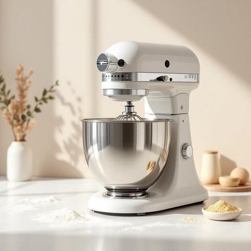

# mixer

<h1 style="font-size: 2.5em; font-weight: 300; letter-spacing: 2px; margin: 0; color: #2c3e50;">
/ˈmɪksər/
</h1>

---

---

## 例句

The development of the mixer, equipped with multiple speed settings and a stainless steel bowl, revolutionized baking by making the thorough combination of ingredients significantly easier.

*The(/ðə/) development(/dɪˈvɛləpmənt/) of(/əv/) the(/ðə/) mixer,(/ˈmɪksər,/) equipped(/ɪkˈwɪpt/) with(/wɪθ/) multiple(/ˈməltəpəl/) speed(/spid/) settings(/ˈsɛtɪŋz/) and(/ənd/) a(/ə/) stainless(/ˈsteɪnləs/) steel(/stil/) bowl,(/boʊl,/) revolutionized(/ˌrɛvəˈluʃəˌnaɪzd/) baking(/ˈbeɪkɪŋ/) by(/baɪ/) making(/ˈmeɪkɪŋ/) the(/ðə/) thorough(/θəroʊ/) combination(/ˌkɑmbəˈneɪʃən/) of(/əv/) ingredients(/ˌɪnˈgridiənts/) significantly(/sɪgˈnɪfɪkəntli/) easier.(/ˈiziər./)*

**翻译：** 带有多档速度调节和不锈钢搅拌碗的搅拌机的发展，革新了烘焙过程，使原料的充分混合变得更加轻松便捷。

---

## 解释

“mixer”作为名词在家居生活用品的语境中，主要指用于混合、搅拌食材的电动或手持设备，如厨房搅拌机或手持打蛋器。具体使用场合通常是在烹饪或烘焙过程中，当需要将面粉、水、鸡蛋、奶油等原料充分混合时会用到mixer。英语学习者使用“mixer”时，注意它通常作可数名词，常见搭配有“stand mixer”（台式搅拌机）、“hand mixer”（手持搅拌机）、“electric mixer”（电动搅拌器）；此外“mixer”也可作动词的衍生名词，即执行混合动作的工具。此外，“mixer”在语法上可与定冠词、不定冠词搭配使用，且常与具体的烹饪动作和容器（如bowl）搭配，如“a mixer for batter”，“use the mixer to blend the ingredients”等。词源上，“mixer”源自动词“mix”加上名词后缀“-er”，表示执行“mix”动作的人或物，最早的“mixer”用法可追溯至19世纪，随着家用电器的发展，其指代搅拌设备的意义逐渐固定。中文语境中，“mixer”一般译为“搅拌机”或“搅拌器”，强调其用于将各种原料均匀混合的功能，无明显褒贬含义，属于中性词且广泛用于厨房生活中。此外，在某些文化中，搅拌机象征现代化和便捷的饮食方式，但本身不带有特殊的文化色彩或情感色彩。整体而言，“mixer”在家居生活用品领域是一个功能性强、使用频率高的常见名词，掌握其用法与搭配有助于提高厨房相关日常英语表达的准确性。

---

<small style="color: #999; font-size: 0.9em;">2025-07-27 09:14:04</small>

