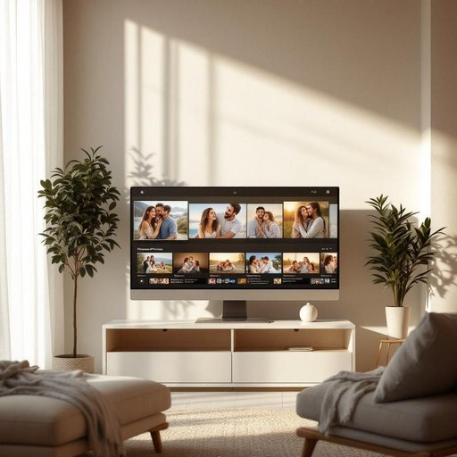

# monitor

<h1 style="font-size: 2.5em; font-weight: 300; letter-spacing: 2px; margin: 0; color: #2c3e50;">
/ˈmɑnətər/
</h1>

---

---

## 例句

Could you please adjust the brightness and contrast on the monitor in the living room, which we use not only for streaming films but also for displaying family photos during gatherings, because the current settings make the images look unnaturally dull and it's affecting the overall atmosphere?

*Could(/kʊd/) you(/ju/) please(/pliz/) adjust(/əˈʤəst/) the(/ðə/) brightness(/ˈbraɪtnəs/) and(/ənd/) contrast(/ˈkɑntræst/) on(/ɔn/) the(/ðə/) monitor(/ˈmɑnətər/) in(/ɪn/) the(/ðə/) living(/ˈlɪvɪŋ/) room,(/rum,/) which(/wɪʧ/) we(/wi/) use(/juz/) not(/nɑt/) only(/ˈoʊnli/) for(/fər/) streaming(/ˈstrimɪŋ/) films(/fɪlmz/) but(/bət/) also(/ˈɔlsoʊ/) for(/fər/) displaying(/dɪˈspleɪɪŋ/) family(/ˈfæməli/) photos(/ˈfoʊˌtoʊz/) during(/ˈdʊrɪŋ/) gatherings,(/ˈgæðərɪŋz,/) because(/bɪˈkəz/) the(/ðə/) current(/ˈkɑrənt/) settings(/ˈsɛtɪŋz/) make(/meɪk/) the(/ðə/) images(/ˈɪmɪʤɪz/) look(/lʊk/) unnaturally(/əˈnæʧərli/) dull(/dəl/) and(/ənd/) it's(/ɪts/) affecting(/əˈfɛktɪŋ/) the(/ðə/) overall(/ˈoʊvərˌɔl/) atmosphere?(/ˈætməsˌfɪr?/)*

**翻译：** 请您调整一下客厅里那台显示器的亮度和对比度，我们不仅用它来播放电影，也会在家庭聚会时展示全家福照片。现在的设置让画面显得不自然地暗淡，影响了整体氛围。

---

## 解释

在家居生活用品场景中，英语单词“monitor”作为名词主要指的是“显示器”，尤其是指电脑显示器或用于视频监控的屏幕设备，常用于描述用于观看图像、视频或实时信息的电子装置。具体使用场合包括电脑桌面上用于显示内容的屏幕、家庭安全系统中的监视器屏幕等。英语学习者在使用“monitor”时需要注意其词性为可数名词，通常使用单数或复数形式monitor/monitors；常见搭配有computer monitor（电脑显示器）、security monitor（安全监视器）、monitor screen（监视屏幕），在表达时通常作为定语后置修饰具体设备。此外，需区分“monitor”作为名词和动词的用法，名词强调设备本身，动词则强调监控或监视的动作。该词源自拉丁语“monēre”，意为“提醒、警告”，反映出其最初与监控、监督相关的含义，传入英语后演变为表示“监视装置”或“提醒装置”。在中文语境中，“monitor”一般准确翻译为“显示器”或“（监控）屏幕”，应避开直译为“监视员”或“班长”等在其他语境下的意思。在日常家居用品领域，没有明显的褒贬色彩，属于中性技术词汇，体现了现代家庭中电子设备的应用和信息观察的功能性质。

---

<small style="color: #999; font-size: 0.9em;">2025-07-27 09:14:04</small>

