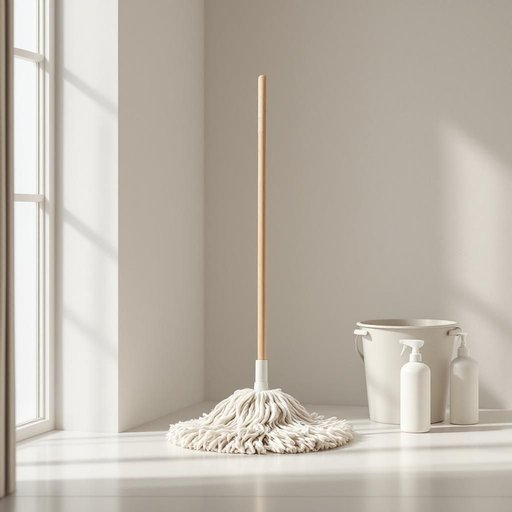

# mop

<h1 style="font-size: 2.5em; font-weight: 300; letter-spacing: 2px; margin: 0; color: #2c3e50;">
/mɑp/
</h1>

---

---

## 例句

Before you start wiping the kitchen floor, could you please fetch the mop from the cupboard under the sink, which is right next to the cleaning sprays and the bucket we use for those stubborn stains in the hallway?

*Before(/ˌbiˈfɔr/) you(/ju/) start(/stɑrt/) wiping(/ˈwaɪpɪŋ/) the(/ðə/) kitchen(/ˈkɪʧən/) floor,(/flɔr,/) could(/kʊd/) you(/ju/) please(/pliz/) fetch(/fɛʧ/) the(/ðə/) mop(/mɑp/) from(/frəm/) the(/ðə/) cupboard(/ˈkəbərd/) under(/ˈəndər/) the(/ðə/) sink,(/sɪŋk,/) which(/wɪʧ/) is(/ɪz/) right(/raɪt/) next(/nɛkst/) to(/tɪ/) the(/ðə/) cleaning(/ˈklinɪŋ/) sprays(/spreɪz/) and(/ənd/) the(/ðə/) bucket(/ˈbəkɪt/) we(/wi/) use(/juz/) for(/fər/) those(/ðoʊz/) stubborn(/ˈstəbərn/) stains(/steɪnz/) in(/ɪn/) the(/ðə/) hallway?(/ˈhɔlˌweɪ?/)*

**翻译：** 在你开始擦厨房地板之前，能否请你先从洗手池下面的橱柜里拿出拖把？那里就在我们放清洁喷雾和用于清理走廊顽固污渍的水桶旁边。

---

## 解释

英语单词“mop”作为名词，在家居生活用品的语境中指的是一种用于清洁地面的用具，通常由一束吸水性较强的布条、纱线或海绵固定在柄的一端组成，主要用于拖地或擦拭液体污渍。具体使用场合多见于家庭打扫、清洁工作场所、学校或公共区域等需要清理地面水渍或灰尘的情境中。英语学习者在使用“mop”作为名词时需要注意，其基本形式是可数名词，有单数和复数形式（a mop, two mops），常见搭配包括“mop and bucket”（拖把和水桶）、“wet mop”（湿拖把）、“dry mop”（干拖把）等，表达时通常与动词“use”或“grab”连用，如“grab a mop to clean the spill”表示“拿拖把去清理洒出的液体”；此外，需区别“mop”作为动词的用法，避免混淆。词源方面，“mop”一词源自中世纪英语，可能来自中古荷兰语“moppe”，含义为一团布，最初指用来擦拭的布块，逐渐演变为现代的拖把工具。中文语境中，“mop”准确翻译为“拖把”，强调其家居清洁工具的属性，使用时需注意避免与其他擦拭工具如“抹布”混淆。总体来看，“mop”作为名词没有特殊的褒贬含义或文化色彩，是一个中性且实用的家居词汇，反映了日常生活中必要的清洁工具之一。

---

<small style="color: #999; font-size: 0.9em;">2025-07-27 09:14:04</small>

