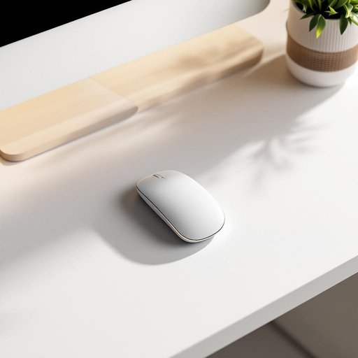

# mouse

<h1 style="font-size: 2.5em; font-weight: 300; letter-spacing: 2px; margin: 0; color: #2c3e50;">
/maʊs/
</h1>

---

---

## 例句

I was about to settle down with a cup of tea and my book when I noticed a tiny mouse darting across the kitchen floor, which reminded me that we really need to get those traps fixed before any more of the cheeky little creatures find their way inside.

*I(/aɪ/) was(/wɑz/) about(/əˈbaʊt/) to(/tɪ/) settle(/ˈsɛtəl/) down(/daʊn/) with(/wɪθ/) a(/ə/) cup(/kəp/) of(/əv/) tea(/ti/) and(/ənd/) my(/maɪ/) book(/bʊk/) when(/wɪn/) I(/aɪ/) noticed(/ˈnoʊtɪst/) a(/ə/) tiny(/ˈtaɪni/) mouse(/maʊs/) darting(/ˈdɑrtɪŋ/) across(/əˈkrɔs/) the(/ðə/) kitchen(/ˈkɪʧən/) floor,(/flɔr,/) which(/wɪʧ/) reminded(/riˈmaɪndɪd/) me(/mi/) that(/ðət/) we(/wi/) really(/ˈrɪli/) need(/nid/) to(/tɪ/) get(/gɪt/) those(/ðoʊz/) traps(/træps/) fixed(/fɪkst/) before(/ˌbiˈfɔr/) any(/ˈɛni/) more(/mɔr/) of(/əv/) the(/ðə/) cheeky(/ˈʧiki/) little(/ˈlɪtəl/) creatures(/ˈkriʧərz/) find(/faɪnd/) their(/ðɛr/) way(/weɪ/) inside.(/ˌɪnˈsaɪd./)*

**翻译：** 正当我准备端着一杯茶坐下来读书时，忽然看到一只小老鼠迅速穿过厨房地板，这让我想起我们确实需要尽快修好那些捕鼠器，以防更多这些调皮的小家伙溜进屋里来。

---

## 解释

英语单词“mouse”在家居生活用品的语境中作为名词，主要指电脑鼠标，是连接电脑用于控制光标或指针的手持设备，常见于办公、学习和家庭娱乐环境中。使用时多出现在例如“computer mouse”“wireless mouse”等短语中，英语学习者应注意“mouse”作为名词时通常为可数名词，复数形式为“mice”，但在指电脑鼠标时复数亦可写作“mouses”，因其专指设备而区别于动物复数。此外，搭配方面常见“click the mouse”“plug in the mouse”“move the mouse”等表达，强调具体操作或使用方式。词源上，“mouse”源自古英语“mus”，原指该小型啮齿动物，因电脑鼠标外形与真实老鼠相似而得名，形成了该词的引申义。在中文语境中，“mouse”准确翻译为“鼠标”，应避免直接译作“老鼠”以免混淆。文化上，鼠标作为现代数字生活的重要工具，通常没有褒贬色彩，但在某些口语或幽默表达中可能被用作“鼠标手”等形容长时间使用电脑产生的身体不适的隐喻。总的来说，理解“mouse”在家居生活用品中的含义，需要结合具体电子设备的使用场景，注意其语法变化和搭配方式，准确区分其动物和电子产品的双重意义。

---

<small style="color: #999; font-size: 0.9em;">2025-07-27 09:14:04</small>

