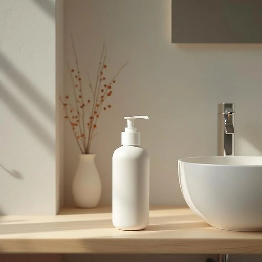

# mouthwash

<h1 style="font-size: 2.5em; font-weight: 300; letter-spacing: 2px; margin: 0; color: #2c3e50;">
/ˈmaʊθˌwɑʃ/
</h1>

---

---

## 例句

After brushing your teeth thoroughly, it’s a good idea to use the mouthwash, which not only helps to freshen your breath but also reaches areas that the toothbrush might have missed, thereby reducing the risk of gum disease and leaving your mouth feeling exceptionally clean.

*After(/ˈæftər/) brushing(/ˈbrəʃɪŋ/) your(/jʊr/) teeth(/tiθ/) thoroughly,(/ˈθəroʊli,/) it’s(/it’s*/) a(/ə/) good(/gʊd/) idea(/aɪˈdiə/) to(/tɪ/) use(/juz/) the(/ðə/) mouthwash,(/ˈmaʊθˌwɑʃ,/) which(/wɪʧ/) not(/nɑt/) only(/ˈoʊnli/) helps(/hɛlps/) to(/tɪ/) freshen(/ˈfrɛʃən/) your(/jʊr/) breath(/brɛθ/) but(/bət/) also(/ˈɔlsoʊ/) reaches(/ˈriʧɪz/) areas(/ˈɛriəz/) that(/ðət/) the(/ðə/) toothbrush(/ˈtuθbrəʃ/) might(/maɪt/) have(/hæv/) missed,(/mɪst,/) thereby(/ˈðɛrˈbaɪ/) reducing(/rɪˈdusɪŋ/) the(/ðə/) risk(/rɪsk/) of(/əv/) gum(/gəm/) disease(/dɪˈziz/) and(/ənd/) leaving(/ˈlivɪŋ/) your(/jʊr/) mouth(/maʊθ/) feeling(/ˈfilɪŋ/) exceptionally(/ɪkˈsɛpʃənəli/) clean.(/klin./)*

**翻译：** 彻底刷牙后，使用漱口水是个不错的选择，它不仅有助于清新口气，还能覆盖牙刷难以触及的部位，从而降低牙龈疾病的风险，使口腔感觉格外清洁。

---

## 解释

英语单词mouthwash作为名词指的是一种用于口腔清洁和杀菌的液体产品通常在刷牙后使用以保持口气清新减少牙菌斑和预防口腔疾病具体使用场合多见于家庭日常生活中如浴室内的洗手台旁或旅行洗漱包中语境通常与口腔卫生相关英语学习者在使用mouthwash时应注意它是不可数名词通常不加复数形式但可用a bottle of mouthwash（一瓶漱口水）或some mouthwash（一些漱口水）来表达数量习惯搭配有use mouthwash（使用漱口水）、rinse with mouthwash（用漱口水漱口）、mouthwash brand（漱口水品牌）等此外mouthwash多用作单一结构的复合词由mouth（嘴）与wash（洗涤）组合而成词源反映其功能即用来洗嘴巴的液体起源于19世纪后期口腔卫生意识增强时期伴随现代卫生产品的发展而普及在中文语境中mouthwash一般准确翻译为漱口水是日常生活中常见的口腔护理用品含义明确无褒贬色彩文化内涵上反映了现代社会对口腔健康和个人卫生的重视

---

<small style="color: #999; font-size: 0.9em;">2025-07-27 09:14:04</small>

