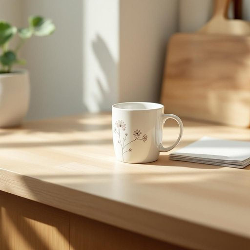

# mug

<h1 style="font-size: 2.5em; font-weight: 300; letter-spacing: 2px; margin: 0; color: #2c3e50;">
/məg/
</h1>

---

---

## 例句

Could you please wash the mug with the floral pattern that’s sitting next to the cluttered stack of unopened mail on the kitchen counter, since I’d like to use it for my tea before starting the work meeting that’s scheduled in half an hour?

*Could(/kʊd/) you(/ju/) please(/pliz/) wash(/wɑʃ/) the(/ðə/) mug(/məg/) with(/wɪθ/) the(/ðə/) floral(/ˈflɔrəl/) pattern(/ˈpætərn/) that’s(/that’s*/) sitting(/ˈsɪtɪŋ/) next(/nɛkst/) to(/tɪ/) the(/ðə/) cluttered(/ˈklətərd/) stack(/stæk/) of(/əv/) unopened(/əˈnoʊpənd/) mail(/meɪl/) on(/ɔn/) the(/ðə/) kitchen(/ˈkɪʧən/) counter,(/ˈkaʊntər,/) since(/sɪns/) I’d(/i’d*/) like(/laɪk/) to(/tɪ/) use(/juz/) it(/ɪt/) for(/fər/) my(/maɪ/) tea(/ti/) before(/ˌbiˈfɔr/) starting(/ˈstɑrtɪŋ/) the(/ðə/) work(/wərk/) meeting(/ˈmitɪŋ/) that’s(/that’s*/) scheduled(/ˈskɛʤʊld/) in(/ɪn/) half(/hæf/) an(/ən/) hour?(/aʊər?/)*

**翻译：** 请帮我洗一下厨房柜台上，堆放着一摞未拆邮件旁边那只带花纹的杯子，我想用它喝茶，然后开始半小时后安排的工作会议。

---

## 解释

英语单词“mug”作为名词在家居生活用品的语境中，指的是一种常见的有柄大杯子，通常用于盛放热饮如咖啡、茶或热巧克力，使用场合多见于家庭厨房、办公桌面或咖啡馆。英语学习者在使用时需注意“mug”作为可数名词，单复数形式分别为“a mug”和“mugs”，且常与表示饮品的词汇搭配，如“一杯茶”（a mug of tea）、“咖啡杯”（a coffee mug），此外，mug的形容词搭配也较多，如“陶瓷杯”（ceramic mug）、“大杯子”（large mug），表达时应根据具体材质、大小或用途进行修饰。在词源上，“mug”源自古英语“mugge”，可能与荷兰语“mugge”（小杯或杯子）相关，最早指一种带柄的容器，演变至今主要指家居使用的饮水杯。中文语境中，“mug”准确翻译为“杯子”或“马克杯”，特别强调其体积较大、有把手、适合热饮的特点，与一般的茶杯或玻璃杯有所区别。需要注意的是，“mug”在英语中另有俚语含义，指“易受骗的人”或“脸”，在家居用品语境之外使用时可能带有轻蔑或调侃意味，但在描述家居饮具时则纯粹是中性词，无贬义或褒义色彩。综上，作为家居生活用品的名词，mug用法正规且实用，学习时重点把握其具体使用环境、常用搭配以及与饮品的语义关系，有助于准确理解和表达。

---

<small style="color: #999; font-size: 0.9em;">2025-07-27 09:14:04</small>

