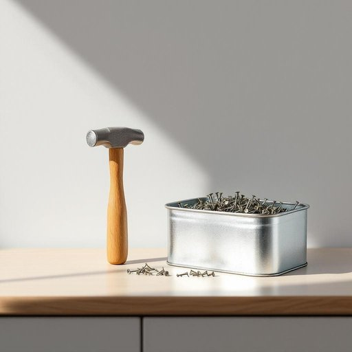

# nail

<h1 style="font-size: 2.5em; font-weight: 300; letter-spacing: 2px; margin: 0; color: #2c3e50;">
/neɪl/
</h1>

---

---

## 例句

Could you please hand me a hammer and a box of nails from the garage, especially the small galvanized nail that’s ideal for hanging those delicate picture frames on the living room wall without damaging the plaster?

*Could(/kʊd/) you(/ju/) please(/pliz/) hand(/hænd/) me(/mi/) a(/ə/) hammer(/ˈhæmər/) and(/ənd/) a(/ə/) box(/bɑks/) of(/əv/) nails(/neɪlz/) from(/frəm/) the(/ðə/) garage,(/gərɑʒ,/) especially(/əˈspɛʃəli/) the(/ðə/) small(/smɔl/) galvanized(/ˈgælvəˌnaɪzd/) nail(/neɪl/) that’s(/that’s*/) ideal(/aɪˈdil/) for(/fər/) hanging(/ˈhæŋɪŋ/) those(/ðoʊz/) delicate(/ˈdɛləkət/) picture(/ˈpɪkʧər/) frames(/freɪmz/) on(/ɔn/) the(/ðə/) living(/ˈlɪvɪŋ/) room(/rum/) wall(/wɔl/) without(/wɪˈθaʊt/) damaging(/ˈdæmɪʤɪŋ/) the(/ðə/) plaster?(/ˈplæstər?/)*

**翻译：** 请你帮我从车库里拿一把锤子和一盒钉子，特别是那种适合挂客厅墙上那些精致相框的小型镀锌钉，以免损坏石膏墙面。

---

## 解释

单词“nail”作为名词在家居生活用品的语境中，通常指的是一种小而细长的金属针状物件，顶端平坦，另一端尖锐，用于将木材或其他材料钉在一起，是基本的建筑和修理工具。具体使用场合包括装修、家具组装、墙壁挂画或日常修补等，常见于家庭和建筑工地。英语学习者在使用“nail”时需注意其单数和复数形式分别为nail和nails，且通常与动词“hammer”（敲打）搭配，如“hammer a nail”（钉钉子）；此外，“nail bed”指指甲床，与家居工具无关，需根据语境区分。该词源自古英语“nagl”，追溯至原始日耳曼语，最初即指用来固定物品的金属钉，反映了其作为固定工具的本质功能。在中文语境中，“nail”准确翻译为“钉子”，是表达固定和连接物体时的标准词汇，无显著褒贬色彩，属于中性工具词，文化内涵主要体现于其使用的实用性与必要性。

---

<small style="color: #999; font-size: 0.9em;">2025-07-27 09:14:04</small>

