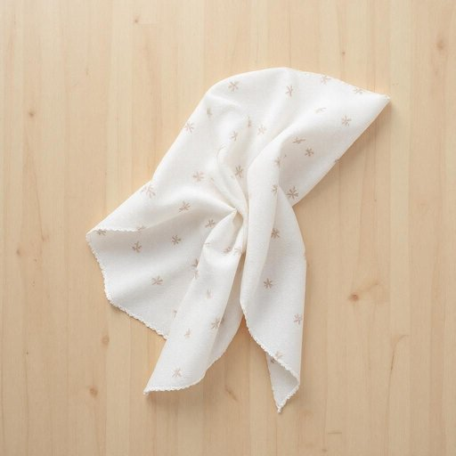

# napkin

<h1 style="font-size: 2.5em; font-weight: 300; letter-spacing: 2px; margin: 0; color: #2c3e50;">
/ˈnæpkɪn/
</h1>

---

---

## 例句

Could you please pass me a clean napkin from the drawer, preferably the one with the floral pattern, since I just spilled some tea on my lap and don’t want to stain the carpet while I tidy up?

*Could(/kʊd/) you(/ju/) please(/pliz/) pass(/pæs/) me(/mi/) a(/ə/) clean(/klin/) napkin(/ˈnæpkɪn/) from(/frəm/) the(/ðə/) drawer,(/drɔr,/) preferably(/ˈprɛfərəbli/) the(/ðə/) one(/wən/) with(/wɪθ/) the(/ðə/) floral(/ˈflɔrəl/) pattern,(/ˈpætərn,/) since(/sɪns/) I(/aɪ/) just(/ʤɪst/) spilled(/spɪld/) some(/səm/) tea(/ti/) on(/ɔn/) my(/maɪ/) lap(/læp/) and(/ənd/) don’t(/don’t*/) want(/wɔnt/) to(/tɪ/) stain(/steɪn/) the(/ðə/) carpet(/ˈkɑrpət/) while(/waɪl/) I(/aɪ/) tidy(/ˈtaɪdi/) up?(/əp?/)*

**翻译：** 请帮我从抽屉里拿一张干净的餐巾，最好是带花纹的那种，因为我刚刚不小心把茶洒到了腿上，整理时不想弄脏地毯。

---

## 解释

英语单词“napkin”作为名词在家居生活用品的语境中，通常指用餐时用来擦嘴或手的小方巾，具体使用场合多为餐桌设置，包括家庭就餐、餐厅、宴会等场景。在英语学习中，注意“napkin”既可以指布制的，也常指纸质的餐巾纸，且其复数形式为“napkins”。常见搭配有“cloth napkin”（布餐巾）、“paper napkin”（纸餐巾）、“fold a napkin”（折叠餐巾）等。语法上，“napkin”作为可数名词，通常前面可加冠词“a”或“the”，如“Please pass me a napkin.”词源上，“napkin”源自中古英语“nappe”意为“桌布”，加上后缀“-kin”表示“小”，整体含义即“小桌布”，最初用于指小布块，后来专指餐巾。在中文语境中，“napkin”准确翻译为“餐巾”，既涵盖布餐巾也包括纸餐巾，不宜混淆为“手帕”或“面巾”，因其专门指餐桌使用的擦拭用品。该词无褒贬含义，文化上餐巾的使用体现一定的礼仪规范，如正式场合使用布餐巾表现对客人的尊重。

---

<small style="color: #999; font-size: 0.9em;">2025-07-27 09:14:04</small>

