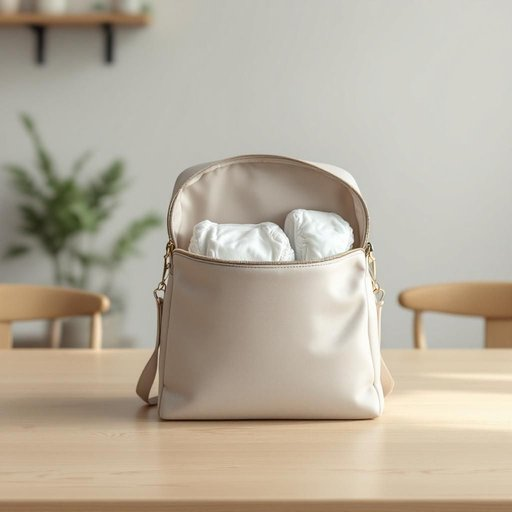

# nappy

<h1 style="font-size: 2.5em; font-weight: 300; letter-spacing: 2px; margin: 0; color: #2c3e50;">
/nappy*/
</h1>

---

---

## 例句

Could you please check the changing bag on the kitchen table to see if there’s a fresh nappy inside, as I forgot to pack one when we left for the park and I’m not sure how long the baby will be comfortable without a proper change?

*Could(/kʊd/) you(/ju/) please(/pliz/) check(/ʧɛk/) the(/ðə/) changing(/ˈʧeɪnʤɪŋ/) bag(/bæg/) on(/ɔn/) the(/ðə/) kitchen(/ˈkɪʧən/) table(/ˈteɪbəl/) to(/tɪ/) see(/si/) if(/ɪf/) there’s(/there’s*/) a(/ə/) fresh(/frɛʃ/) nappy(/nappy*/) inside,(/ˌɪnˈsaɪd,/) as(/ɛz/) I(/aɪ/) forgot(/fərˈgɑt/) to(/tɪ/) pack(/pæk/) one(/wən/) when(/wɪn/) we(/wi/) left(/lɛft/) for(/fər/) the(/ðə/) park(/pɑrk/) and(/ənd/) I’m(/i’m*/) not(/nɑt/) sure(/ʃʊr/) how(/haʊ/) long(/lɔŋ/) the(/ðə/) baby(/ˈbeɪbi/) will(/wɪl/) be(/bi/) comfortable(/ˈkəmfərtəbəl/) without(/wɪˈθaʊt/) a(/ə/) proper(/ˈprɑpər/) change?(/ʧeɪnʤ?/)*

**翻译：** 你能帮忙检查一下放在厨房桌上的尿布包，看看里面有没有干净的尿布吗？我出门去公园时忘了带，担心宝宝没及时换尿布会不舒服，不知道他还能舒服多久。

---

## 解释

英语单词“nappy”作为名词，在家居生活用品领域通常指“尿布”或“婴儿用的尿布”，多用于英国英语中。具体使用场合通常是在谈论婴儿护理、换尿布或婴幼儿日常生活相关的话题中，例如“change a baby’s nappy”（给婴儿换尿布）或“cloth nappy”（布尿布）。英语学习者在使用时需要注意“nappy”作为名词时通常是可数名词，复数形式为“nappies”，且在表达搭配上多与“change”、“put on”、“take off”等动词连用，另外要区分与美式英语中相对应的“diaper”，后者在美国更为常用。词源上，“nappy”源自19世纪中期，可能源自“nap”（即织物表面的绒起部分）一词，最初指带绒的布料，后引申为包裹婴儿的布制品。中文语境中，“nappy”准确翻译为“尿布”，理解时应避免与“头发蓬乱的”或“卷曲的”形容词义混淆，该词作为名词无褒贬色彩，但需注意其为英式表达，使用时根据受众选择更合适的词汇以避免地域差异引起的理解误会。

---

<small style="color: #999; font-size: 0.9em;">2025-07-27 09:14:04</small>

