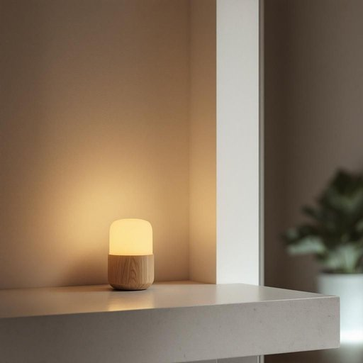

# nightlight

<h1 style="font-size: 2.5em; font-weight: 300; letter-spacing: 2px; margin: 0; color: #2c3e50;">
/nightlight*/
</h1>

---

---

## 例句

Before we head off to bed, could you please check if the nightlight in the hallway, which has that soft, warm glow designed to guide us without disturbing our sleep, is plugged in correctly, since it really helps the kids feel more secure when they get up in the middle of the night?

*Before(/ˌbiˈfɔr/) we(/wi/) head(/hɛd/) off(/ɔf/) to(/tɪ/) bed,(/bɛd,/) could(/kʊd/) you(/ju/) please(/pliz/) check(/ʧɛk/) if(/ɪf/) the(/ðə/) nightlight(/nightlight*/) in(/ɪn/) the(/ðə/) hallway,(/ˈhɔlˌweɪ,/) which(/wɪʧ/) has(/həz/) that(/ðət/) soft,(/sɔft,/) warm(/wɔrm/) glow(/gloʊ/) designed(/dɪˈzaɪnd/) to(/tɪ/) guide(/gaɪd/) us(/ˈjuˈɛs/) without(/wɪˈθaʊt/) disturbing(/dɪˈstərbɪŋ/) our(/ɑr/) sleep,(/slip,/) is(/ɪz/) plugged(/pləgd/) in(/ɪn/) correctly,(/kərˈɛktli,/) since(/sɪns/) it(/ɪt/) really(/ˈrɪli/) helps(/hɛlps/) the(/ðə/) kids(/kɪdz/) feel(/fil/) more(/mɔr/) secure(/sɪˈkjʊr/) when(/wɪn/) they(/ðeɪ/) get(/gɪt/) up(/əp/) in(/ɪn/) the(/ðə/) middle(/ˈmɪdəl/) of(/əv/) the(/ðə/) night?(/naɪt?/)*

**翻译：** 在我们上床睡觉之前，能否请你帮忙检查一下走廊里的夜灯是否正确插好？那盏灯散发出柔和温暖的光芒，既能引导我们，又不会打扰睡眠，对孩子们来说非常重要，能让他们半夜起床时感到更安心。

---

## 解释

英语单词“nightlight”作为名词，主要指家居生活用品中的小夜灯，通常是在晚上用于提供柔和、微弱照明的灯具，帮助人在黑暗中看清周围环境，防止摔倒或为儿童提供安全感，使用场合多见于卧室、儿童房、走廊或卫生间等夜间活动频繁但不需要强光的空间，英语学习者在使用“nightlight”时，应注意其作为可数名词，可与限定词如a、the连用，同时常用于复数形式nightlights，常见搭配包括“plug in a nightlight”（插入小夜灯）、“use a nightlight”（使用小夜灯）和“a soft/dim nightlight”（柔和的小夜灯），此外，nightlight的构词来源于night（夜晚）和light（灯光），合成词直观表达其夜间照明的功能，历史上随着电灯普及，小夜灯的设计和功能也逐渐丰富，成为居家安全和舒适的重要辅助手段，在中文语境中，“nightlight”通常翻译为“小夜灯”或“夜灯”，强调其用途和形态，即用于夜间照明的辅助设备，表达准确且无贬义色彩，具有温馨、安全的文化内涵，常用于描述儿童或老人家庭环境的护理措施，总之，“nightlight”作为生活日常词汇，既指实物也蕴含照明安全、夜晚安心的心理意涵，适用于多种居家语境。

---

<small style="color: #999; font-size: 0.9em;">2025-07-27 09:14:04</small>

