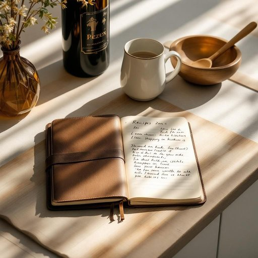

# notebook

<h1 style="font-size: 2.5em; font-weight: 300; letter-spacing: 2px; margin: 0; color: #2c3e50;">
/ˈnoʊtˌbʊk/
</h1>

---

---

## 例句

After tidying up the cluttered kitchen counter, she picked up the worn leather-bound notebook, in which she had meticulously jotted down all her favourite recipes and shopping lists, before settling down at the dining table to plan the week’s meals.

*After(/ˈæftər/) tidying(/tidying*/) up(/əp/) the(/ðə/) cluttered(/ˈklətərd/) kitchen(/ˈkɪʧən/) counter,(/ˈkaʊntər,/) she(/ʃi/) picked(/pɪkt/) up(/əp/) the(/ðə/) worn(/wɔrn/) leather-bound(/leather-bound*/) notebook,(/ˈnoʊtˌbʊk,/) in(/ɪn/) which(/wɪʧ/) she(/ʃi/) had(/hæd/) meticulously(/məˈtɪkjələsli/) jotted(/ˈʤɑtɪd/) down(/daʊn/) all(/ɔl/) her(/hər/) favourite(/ˈfeɪvərɪt/) recipes(/ˈrɛsəpiz/) and(/ənd/) shopping(/ˈʃɑpɪŋ/) lists,(/lɪsts,/) before(/ˌbiˈfɔr/) settling(/ˈsɛtəlɪŋ/) down(/daʊn/) at(/æt/) the(/ðə/) dining(/ˈdaɪnɪŋ/) table(/ˈteɪbəl/) to(/tɪ/) plan(/plæn/) the(/ðə/) week’s(/week’s*/) meals.(/milz./)*

**翻译：** 整理好杂乱的厨房台面后，她拿起那本破旧的皮革笔记本，里面细心地记载着她所有喜爱的食谱和购物清单，然后坐到餐桌旁，开始规划一周的餐食。

---

## 解释

单词“notebook”作为名词在家居生活用品的语境中，通常指用于书写或记载信息的小册子或活页本，常见于学习、工作或日常生活中用来记笔记、记录备忘或写日记的工具，具体使用场合如家庭书房、厨房便签记录、儿童写作业、个人计划安排等环境中均可见其身影，英语学习者在使用“notebook”时需注意其为可数名词，复数形式为“notebooks”，且常与动词“take”（如take notes in a notebook）搭配出现，此外，“notebook”也可用作形容词构成复合名词，如“notebook computer”（笔记本电脑），这点应根据语境区分，词源上，“notebook”由“note”（笔记）和“book”（书）合成，反映其作为记录工具的本质，起源于15世纪末至16世纪初，伴随印刷和纸张普及而普遍使用，在中文语境中，“notebook”通常准确译为“笔记本”或“笔记本本子”，与“笔记本电脑”有所区别，需根据上下文明确含义，该词语本身无明显褒贬色彩或特殊文化内涵，其含义中性且普遍认同，是描述日常生活和学习必备的书写用品，使用时只需注意避免与电子设备混淆即可。

---

<small style="color: #999; font-size: 0.9em;">2025-07-27 09:14:04</small>

