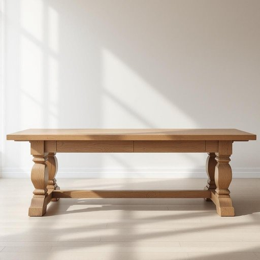

# oak

<h1 style="font-size: 2.5em; font-weight: 300; letter-spacing: 2px; margin: 0; color: #2c3e50;">
/oʊk/
</h1>

---

---

## 例句

The sturdy oak dining table, which my grandmother bought decades ago and has been lovingly restored with a fresh coat of varnish and intricate hand-carved details, has become the centerpiece of our living room, providing both a timeless aesthetic and a solid surface for family gatherings, homework sessions, and countless cups of tea.

*The(/ðə/) sturdy(/ˈstərdi/) oak(/oʊk/) dining(/ˈdaɪnɪŋ/) table,(/ˈteɪbəl,/) which(/wɪʧ/) my(/maɪ/) grandmother(/ˈgrændˌməðər/) bought(/bɔt/) decades(/ˈdɛkeɪdz/) ago(/əˈgoʊ/) and(/ənd/) has(/həz/) been(/bɪn/) lovingly(/ˈləvɪŋli/) restored(/rɪˈstɔrd/) with(/wɪθ/) a(/ə/) fresh(/frɛʃ/) coat(/koʊt/) of(/əv/) varnish(/ˈvɑrnɪʃ/) and(/ənd/) intricate(/ˈɪntrəkət/) hand-carved(/hand-carved*/) details,(/ˈditeɪlz,/) has(/həz/) become(/bɪˈkəm/) the(/ðə/) centerpiece(/ˈsɛntərˌpis/) of(/əv/) our(/ɑr/) living(/ˈlɪvɪŋ/) room,(/rum,/) providing(/prəˈvaɪdɪŋ/) both(/boʊθ/) a(/ə/) timeless(/ˈtaɪmləs/) aesthetic(/ɛsˈθɛtɪk/) and(/ənd/) a(/ə/) solid(/ˈsɑləd/) surface(/ˈsərfəs/) for(/fər/) family(/ˈfæməli/) gatherings,(/ˈgæðərɪŋz,/) homework(/ˈhoʊmˌwərk/) sessions,(/ˈsɛʃənz,/) and(/ənd/) countless(/ˈkaʊntləs/) cups(/kəps/) of(/əv/) tea.(/ti./)*

**翻译：** 这张结实的橡木餐桌，是我祖母几十年前购置的，经过精心修复，涂上了崭新的清漆，并雕刻了精致的手工花纹，现已成为我们客厅的核心，不仅展现出永恒的美感，还为家庭聚会、学习时光和无数次品茶提供了坚实的桌面。

---

## 解释

英语单词“oak”作为名词在家居生活用品的语境中，主要指“橡木”，即一种坚硬且耐用的木材，广泛用于制造家具如桌子、椅子、橱柜及地板等。具体使用场合通常涉及对家具材质的描述、家居装修选择或购物时的材质比较，例如“The dining table is made of oak”（餐桌是橡木制成的）。英语学习者在使用“oak”时应注意其为可数名词，也可以泛指橡木材质（不可数），常见搭配有“oak furniture”（橡木家具）、“oak floor”（橡木地板）、“oak cabinet”（橡木橱柜）等，且通常不用于复数形式表达材质，但作为树木时可用复数“oaks”表示多棵橡树。词源方面，“oak”源自古英语“āc”，源自原始日耳曼语，历史悠久，与橡树这一象征坚韧和长寿的植物相关联。在中文语境中，准确翻译为“橡木”，需区别于指橡树本身“橡树”这一植物名词，特别是在家居用品中主要指橡木材质。该词无褒贬色彩，但因橡木材质坚固且昂贵，常带有质感优良、耐用高档的正面文化内涵，使用时可体现家具或装修的质量和品味。

---

<small style="color: #999; font-size: 0.9em;">2025-07-27 09:14:04</small>

