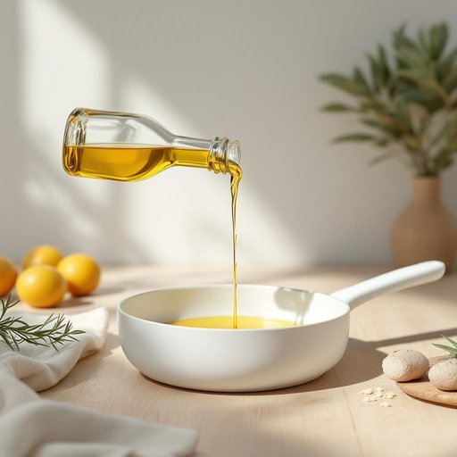

# oil

<h1 style="font-size: 2.5em; font-weight: 300; letter-spacing: 2px; margin: 0; color: #2c3e50;">
/ɔɪl/
</h1>

---

---

## 例句

Before you start frying the vegetables, make sure to heat a generous amount of oil in the pan, preferably olive oil, which not only prevents sticking but also adds a subtle flavour that enhances the overall dish.

*Before(/ˌbiˈfɔr/) you(/ju/) start(/stɑrt/) frying(/fraɪɪŋ/) the(/ðə/) vegetables,(/ˈvɛʤtəbəlz,/) make(/meɪk/) sure(/ʃʊr/) to(/tɪ/) heat(/hit/) a(/ə/) generous(/ˈʤɛnərəs/) amount(/əˈmaʊnt/) of(/əv/) oil(/ɔɪl/) in(/ɪn/) the(/ðə/) pan,(/pæn,/) preferably(/ˈprɛfərəbli/) olive(/ˈɑlɪv/) oil,(/ɔɪl,/) which(/wɪʧ/) not(/nɑt/) only(/ˈoʊnli/) prevents(/prɪˈvɛnts/) sticking(/ˈstɪkɪŋ/) but(/bət/) also(/ˈɔlsoʊ/) adds(/ædz/) a(/ə/) subtle(/ˈsətəl/) flavour(/flavour*/) that(/ðət/) enhances(/ɛnˈhænsɪz/) the(/ðə/) overall(/ˈoʊvərˌɔl/) dish.(/dɪʃ./)*

**翻译：** 在开始煎炒蔬菜之前，务必在锅中加热足量的油，最好是橄榄油，这不仅能防止食材粘锅，还能赋予菜肴细腻的风味，提升整体口感。

---

## 解释

单词“oil”作为名词在家居生活用品的语境中，通常指各种液状的脂肪类物质，用于烹饪、润滑或美容等用途。具体使用场合包括厨房中常见的食用油（如橄榄油、菜籽油），以及家具保养时的护理油或润滑机械设备用的机油。在日常表达中，“oil”常与动词“use”、“apply”、“pour”等搭配，表示使用油或涂抹油脂，此外“cooking oil”（食用油）、“olive oil”（橄榄油）、“vegetable oil”（植物油）等是常见的固定搭配。语法上，“oil”作为不可数名词使用较多，但在特指某种类型或容器时可用复数形式“oils”，例如精油（essential oils）。英语学习者需注意“oil”作名词时无复数时保持单数动词一致性。此外，“oil”也可用作动词，表示“给…上油”，但此处不讨论动词用法。词源方面，“oil”源自古法语“oile”，进一步源自拉丁语“oleum”，意思为橄榄油，这反映了油品最初在地中海地区的广泛使用及其重要性。中文语境中，“oil”通常译为“油”，但要根据具体语境准确区分，例如家居中用于烹饪的应译为“食用油”，用于机械润滑的译为“机油”，用于美容护理的则可能称作“护肤油”或“精油”，以避免理解混淆。总体而言，作为家居生活用品名词的“oil”含义中性无褒贬色彩，但因不同油品的用途和品质差异，其在实际使用中的语义具体且具有实用价值，反映了其在日常生活和文化中的多样功能。

---

<small style="color: #999; font-size: 0.9em;">2025-07-27 09:14:04</small>

