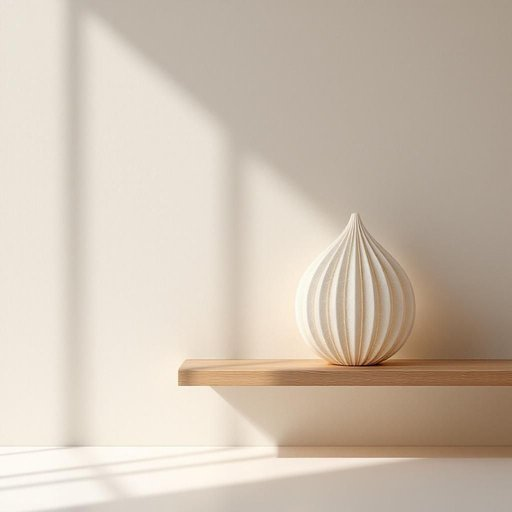

# ornament

<h1 style="font-size: 2.5em; font-weight: 300; letter-spacing: 2px; margin: 0; color: #2c3e50;">
/ˈɔrnəmənt/
</h1>

---

---

## 例句

I admired the ornament's craftsmanship, noting that the ornament's value surpassed that of any other family heirloom displayed in the room.

*I(/aɪ/) admired(/ədˈmaɪərd/) the(/ðə/) ornament's(/ornament's*/) craftsmanship,(/ˈkræftsmənˌʃɪp,/) noting(/ˈnoʊtɪŋ/) that(/ðət/) the(/ðə/) ornament's(/ornament's*/) value(/ˈvælju/) surpassed(/sərˈpæst/) that(/ðət/) of(/əv/) any(/ˈɛni/) other(/ˈəðər/) family(/ˈfæməli/) heirloom(/ˈɛˌrlum/) displayed(/dɪˈspleɪd/) in(/ɪn/) the(/ðə/) room.(/rum./)*

**翻译：** 我赞赏这件饰品的工艺，指出它的价值超过了屋内陈列的其他任何家传珍宝。

---

## 解释

英语单词“ornament”作为名词在家居生活用品场景中，主要指用于装饰和美化居室环境的小物件，如摆设、装饰品、挂件等，常见于书架、桌面、墙壁或圣诞树上等位置。具体使用场合通常涉及描述室内装饰、节日布置或艺术陈设时，表达这些物品的视觉和审美价值。英语学习者需注意“ornament”作为可数名词，复数形式为“ornaments”，常见搭配有“Christmas ornaments”（圣诞装饰品）、“decorative ornaments”（装饰性饰品）、“ceramic ornaments”等，此外，“ornament”也可作为动词使用，表示“装饰”，但这时其用法和含义有所不同。在语法上，作名词时通常用作主语或宾语，可以与表示材质、用途或场合的形容词连用，以突出其装饰性质。词源方面，“ornament”源自拉丁语“ornamentum”，意为“装饰、器物”，传入英语后保持了其装饰和美化的含义，反映了文化中对美学和物品功能的重视。在中文语境中，“ornament”准确翻译为“装饰品”或“饰品”，强调其非功能性、凸显美感的特点，语义较为中性，不含明显褒贬色彩，但在使用时需区分与“实用器具”的不同，以免混淆产品定位。整体来看，“ornament”在家居生活中的使用充满文化审美意义，体现了人们追求环境美化和情感表达的需求。

---

<small style="color: #999; font-size: 0.9em;">2025-07-27 09:14:04</small>

