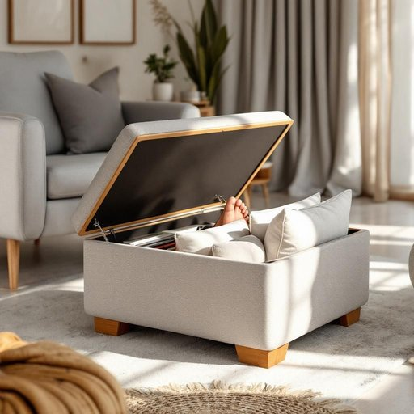

# ottoman

<h1 style="font-size: 2.5em; font-weight: 300; letter-spacing: 2px; margin: 0; color: #2c3e50;">
/ˈɑtəmən/
</h1>

---

---

## 例句

After tidying up the living room, she sat down on the plush armchair and kicked her tired feet onto the ottoman, which, besides serving as a comfortable footrest, cleverly concealed a storage compartment filled with extra cushions and magazines.

*After(/ˈæftər/) tidying(/tidying*/) up(/əp/) the(/ðə/) living(/ˈlɪvɪŋ/) room,(/rum,/) she(/ʃi/) sat(/sæt/) down(/daʊn/) on(/ɔn/) the(/ðə/) plush(/pləʃ/) armchair(/ˈɑrmˌʧɛr/) and(/ənd/) kicked(/kɪkt/) her(/hər/) tired(/taɪərd/) feet(/fit/) onto(/ˈɔntu/) the(/ðə/) ottoman,(/ˈɑtəmən,/) which,(/wɪʧ,/) besides(/ˌbiˈsaɪdz/) serving(/ˈsərvɪŋ/) as(/ɛz/) a(/ə/) comfortable(/ˈkəmfərtəbəl/) footrest,(/footrest*,/) cleverly(/ˈklɛvərli/) concealed(/kənˈsild/) a(/ə/) storage(/ˈstɔrɪʤ/) compartment(/kəmˈpɑrtmənt/) filled(/fɪld/) with(/wɪθ/) extra(/ˈɛkstrə/) cushions(/ˈkʊʃənz/) and(/ənd/) magazines.(/ˈmægəˌzinz./)*

**翻译：** 整理好客厅后，她坐在柔软的扶手椅上，将疲惫的双脚伸到脚凳上。这个脚凳不仅是舒适的靠脚之处，还巧妙地隐藏着一个储物格，里面放着备用的靠垫和杂志。

---

## 解释

“ottoman”作为名词，在家居生活用品的语境中通常指一种低矮、无靠背的软垫凳或脚凳，有时带储物功能，常见于客厅或休息区，用于让人搭脚休息或临时坐人。具体使用场合多为描述家具布置、家居装饰或日常生活场景，如“You can put your feet up on the ottoman”（你可以把脚搭在脚凳上）。英语学习者在使用该词时应注意其可数名词特性，通常复数形式为“ottomans”，且常与形容词如“leather ottoman”、“fabric ottoman”或表示功能的词如“storage ottoman”搭配；此外，语境中“ottoman”通常指具体家具，避免与其他含义混淆。该词源自土耳其语“Osmanlı”，原指奥斯曼帝国，因奥斯曼帝国风格的家具在欧洲传入而得名，反映了文化传播的历史背景。在中文中，“ottoman”通常准确翻译为“脚凳”或“软凳”，部分带储物功能者可称“储物脚凳”，强调其实用性和舒适性。需要注意的是，在中文语境中该词无褒贬色彩，主要作为家居用品名词中性使用，文化色彩较淡，更多侧重功能和风格属性，而非特定文化含义。

---

<small style="color: #999; font-size: 0.9em;">2025-07-27 09:14:04</small>

