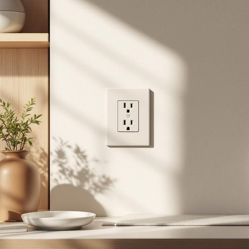

# outlet

<h1 style="font-size: 2.5em; font-weight: 300; letter-spacing: 2px; margin: 0; color: #2c3e50;">
/ˈaʊˌtlɛt/
</h1>

---

---

## 例句

Before installing the state-of-the-art refrigerator in the newly renovated kitchen, it is crucial to ensure that the dedicated electrical outlet, which must be properly grounded and compliant with local safety codes, is easily accessible and capable of supporting the appliance’s high power consumption without risking overload or potential fire hazards, as failure to do so could result in costly repairs or dangerous malfunctions.

*Before(/ˌbiˈfɔr/) installing(/ˌɪnˈstɔlɪŋ/) the(/ðə/) state-of-the-art(/ˌsteɪtəvðɪˈɑrt/) refrigerator(/rɪˈfrɪʤərˌeɪtər/) in(/ɪn/) the(/ðə/) newly(/ˈnuli/) renovated(/ˈrɛnəˌveɪtɪd/) kitchen,(/ˈkɪʧən,/) it(/ɪt/) is(/ɪz/) crucial(/ˈkruʃəl/) to(/tɪ/) ensure(/ɪnˈʃʊr/) that(/ðət/) the(/ðə/) dedicated(/ˈdɛdəkeɪtəd/) electrical(/ɪˈlɛktrɪkəl/) outlet,(/ˈaʊˌtlɛt,/) which(/wɪʧ/) must(/məst/) be(/bi/) properly(/ˈprɑpərli/) grounded(/ˈgraʊndɪd/) and(/ənd/) compliant(/kəmˈplaɪənt/) with(/wɪθ/) local(/ˈloʊkəl/) safety(/ˈseɪfti/) codes,(/koʊdz,/) is(/ɪz/) easily(/ˈizəli/) accessible(/ækˈsɛsəbəl/) and(/ənd/) capable(/ˈkeɪpəbəl/) of(/əv/) supporting(/səˈpɔrtɪŋ/) the(/ðə/) appliance’s(/appliance’s*/) high(/haɪ/) power(/paʊər/) consumption(/kənˈsəmʃən/) without(/wɪˈθaʊt/) risking(/ˈrɪskɪŋ/) overload(/ˈoʊvərˌloʊd/) or(/ər/) potential(/pəˈtɛnʃəl/) fire(/faɪər/) hazards,(/ˈhæzərdz,/) as(/ɛz/) failure(/ˈfeɪljər/) to(/tɪ/) do(/du/) so(/soʊ/) could(/kʊd/) result(/rɪˈzəlt/) in(/ɪn/) costly(/ˈkɔstli/) repairs(/rɪˈpɛrz/) or(/ər/) dangerous(/ˈdeɪnʤərəs/) malfunctions.(/mælˈfəŋkʃənz./)*

**翻译：** 在安装新装修厨房内的先进冰箱之前，务必确保专用电源插座既符合当地安全规范且接地良好，又便于使用，且能够承受电器高功率的耗电要求，避免因过载引发潜在火灾隐患，否则可能导致昂贵的维修费用或危险故障。

---

## 解释

英语单词“outlet”在家居生活用品场景中作为名词，主要指电器或电子设备充电和供电的插座，即“插座”或“电源插座”。具体使用场合通常是在描述家中墙面上或家具上的电源插座位置，例如“Please plug the charger into the outlet”表示“请把充电器插入插座”。对于英语学习者来说，“outlet”作为名词通常是可数名词，常用复数形式“outlets”，且其后常跟介词短语如“outlet for”（用于某种用途的出口）但在家居用品语境中多与电源插座相关。常见搭配还包括“power outlet”（电源插座）、“electrical outlet”（电气插座）等。语法上注意“outlet”作为名词时可以直接作宾语，前面可加冠词或定冠词，例：“the outlet”，且在同一语境下与“plug”（插头）、“socket”（插槽，但在英式英语中“socket”更常用）等词易混淆。词源上，“outlet”由“out”（向外）与“let”（允许、放出）组成，本意指“出路”或“出口”，后来引申至电源插座因为电流“输出”的意义而得名。这一词义来源于电力设备的开放端口，允许用电器接入电网。中文中，“outlet”在家居生活用品语境下准确翻译为“插座”或“电源插座”，强调的是电气设备连接点的功能，避免与商业领域的“专卖店”翻译混淆。总体上，“outlet”在该场景没有褒贬含义或特殊文化色彩，是一个中性且实用的技术性词汇，理解时应结合语境区分其不同含义。

---

<small style="color: #999; font-size: 0.9em;">2025-07-27 09:14:04</small>

