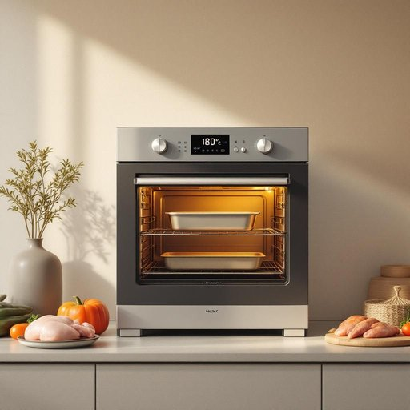

# oven

<h1 style="font-size: 2.5em; font-weight: 300; letter-spacing: 2px; margin: 0; color: #2c3e50;">
/ˈəvən/
</h1>

---

---

## 例句

Before you start preheating the oven, which we usually set to 180 degrees for roasting, could you check if the baking tray is clean and make sure that the timer is working properly, just in case we lose track of time while preparing the vegetables and marinating the chicken?

*Before(/ˌbiˈfɔr/) you(/ju/) start(/stɑrt/) preheating(/preheating*/) the(/ðə/) oven,(/ˈəvən,/) which(/wɪʧ/) we(/wi/) usually(/ˈjuʒəwəli/) set(/sɛt/) to(/tɪ/) 180(/180/) degrees(/dɪˈgriz/) for(/fər/) roasting,(/ˈroʊstɪŋ,/) could(/kʊd/) you(/ju/) check(/ʧɛk/) if(/ɪf/) the(/ðə/) baking(/ˈbeɪkɪŋ/) tray(/treɪ/) is(/ɪz/) clean(/klin/) and(/ənd/) make(/meɪk/) sure(/ʃʊr/) that(/ðət/) the(/ðə/) timer(/ˈtaɪmər/) is(/ɪz/) working(/ˈwərkɪŋ/) properly,(/ˈprɑpərli,/) just(/ʤɪst/) in(/ɪn/) case(/keɪs/) we(/wi/) lose(/luz/) track(/træk/) of(/əv/) time(/taɪm/) while(/waɪl/) preparing(/pərˈpɛrɪŋ/) the(/ðə/) vegetables(/ˈvɛʤtəbəlz/) and(/ənd/) marinating(/ˈmɛrəˌneɪtɪŋ/) the(/ðə/) chicken?(/ˈʧɪkən?/)*

**翻译：** 在你开始预热烤箱之前（我们通常设定为180度用于烤制），请先检查烤盘是否干净，并确认计时器是否正常工作，以防在准备蔬菜和腌制鸡肉时忘记时间。

---

## 解释

英语单词oven作为名词，主要指家居生活中用于加热、烹饪食物的“烤箱”或“炉子”，常见于厨房环境，如烤面包、烘焙蛋糕、烤制肉类等场合。学习者需要注意，oven在语法上是可数名词，通常前面可加冠词a/an或the，复数形式为ovens，常见搭配有“electric oven”（电烤箱）、“gas oven”（燃气烤箱）、“conventional oven”（传统烤箱）、“preheat the oven”（预热烤箱）等。此外，oven常与动词如bake、roast、preheat等搭配，构成常用表达。词源上，oven源自古英语ofen，来源于日耳曼语族，原意即为用来烘烤或加热的密闭空间，反映了其传统的功能和结构。在中文语境中，oven通常准确翻译为“烤箱”，强调其烘焙和加热食物的功能，而非单纯指火炉或炉灶，避免混淆。该词本身中性无明显褒贬色彩，属于日常厨房用品的常用词，反映饮食文化中家庭烹饪的重要设备，体现现代生活中对方便烹饪的需求。

---

<small style="color: #999; font-size: 0.9em;">2025-07-27 09:14:04</small>

