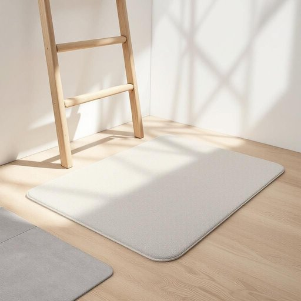

# pad

<h1 style="font-size: 2.5em; font-weight: 300; letter-spacing: 2px; margin: 0; color: #2c3e50;">
/pæd/
</h1>

---

---

## 例句

Before you start painting the kitchen walls, make sure to place a thick, absorbent pad under the ladder, not only to protect the wooden floor from unexpected drips and scratches but also to provide extra stability on the slippery tiles.

*Before(/ˌbiˈfɔr/) you(/ju/) start(/stɑrt/) painting(/ˈpeɪnɪŋ/) the(/ðə/) kitchen(/ˈkɪʧən/) walls,(/wɔlz,/) make(/meɪk/) sure(/ʃʊr/) to(/tɪ/) place(/pleɪs/) a(/ə/) thick,(/θɪk,/) absorbent(/əbˈzɔrbənt/) pad(/pæd/) under(/ˈəndər/) the(/ðə/) ladder,(/ˈlædər,/) not(/nɑt/) only(/ˈoʊnli/) to(/tɪ/) protect(/prəˈtɛkt/) the(/ðə/) wooden(/ˈwʊdən/) floor(/flɔr/) from(/frəm/) unexpected(/ˌənɪkˈspɛktɪd/) drips(/drɪps/) and(/ənd/) scratches(/ˈskræʧɪz/) but(/bət/) also(/ˈɔlsoʊ/) to(/tɪ/) provide(/prəˈvaɪd/) extra(/ˈɛkstrə/) stability(/stəˈbɪlɪti/) on(/ɔn/) the(/ðə/) slippery(/sˈlɪpəri/) tiles.(/taɪlz./)*

**翻译：** 在开始粉刷厨房墙壁之前，务必在梯子下铺设一块厚实且吸水性强的垫子，这不仅可以保护木地板免受意外滴落和划痕的损害，还能在光滑的瓷砖上提供额外的稳定支撑。

---

## 解释

英语单词“pad”作为名词在家居生活用品场景中，通常指用于保护、缓冲或吸附的软垫、垫子，具体使用场合包括餐桌上的餐垫（e.g., placemat）、家具下面防止刮地板的小垫（e.g., furniture pad）、笔记本电脑保护垫、擦拭用的抹布垫（cleaning pad）以及用于坐垫或床垫的衬垫等。英语学习者在使用“pad”时应注意其名词形态通常为单数或复数（pads），可与形容词连用形成常见搭配如“mouse pad”（鼠标垫）、“heating pad”（热敷垫）、“sanitary pad”（卫生巾）等，且“pad”作为名词时不用于复合词中作动词形式，语法上一般只充当可数名词，有时也指代数量较小的软垫或薄片。该词源自中古英语“padde”，进一步追溯其起源可能与古北欧语有关，意指填充物或垫子，反映其本质为提供柔软或保护作用的物品。在中文语境中，“pad”多译作“垫子”、“垫片”、“护垫”等，依具体用途细分，例如“鼠标垫”、“隔热垫”、“擦拭垫”，精准翻译需结合具体场合使用。需要注意的是，“pad”在现代英语中有时带有较为口语化和生活化的色彩，且在某些搭配中如“sanitary pad”带有卫生用品的特殊文化含义，不具贬义，但语境敏感。学习者应避免将其与面积大、功能复杂的垫子混淆，同时注意不同复合搭配的词义差异，以保证准确表达家居生活相关的软垫物品。

---

<small style="color: #999; font-size: 0.9em;">2025-07-27 09:14:04</small>

