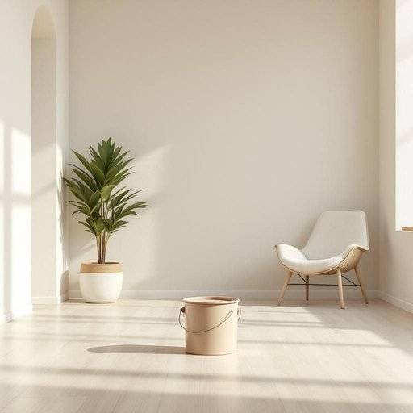

# paint

<h1 style="font-size: 2.5em; font-weight: 300; letter-spacing: 2px; margin: 0; color: #2c3e50;">
/peɪnt/
</h1>

---

---

## 例句

Before we start redecorating the living room, could you please check if the paint we bought last month is still usable, considering that it’s been stored in the damp garage and might have separated or thickened over time?

*Before(/ˌbiˈfɔr/) we(/wi/) start(/stɑrt/) redecorating(/riˈdɛkərˌeɪtɪŋ/) the(/ðə/) living(/ˈlɪvɪŋ/) room,(/rum,/) could(/kʊd/) you(/ju/) please(/pliz/) check(/ʧɛk/) if(/ɪf/) the(/ðə/) paint(/peɪnt/) we(/wi/) bought(/bɔt/) last(/læst/) month(/mənθ/) is(/ɪz/) still(/stɪl/) usable,(/ˈjuzəbəl,/) considering(/kənˈsɪdərɪŋ/) that(/ðət/) it’s(/it’s*/) been(/bɪn/) stored(/stɔrd/) in(/ɪn/) the(/ðə/) damp(/dæmp/) garage(/gərɑʒ/) and(/ənd/) might(/maɪt/) have(/hæv/) separated(/ˈsɛpərˌeɪtɪd/) or(/ər/) thickened(/ˈθɪkənd/) over(/ˈoʊvər/) time?(/taɪm?/)*

**翻译：** 在我们开始重新装修客厅之前，请你检查一下我们上个月购买的油漆是否还能使用，毕竟它一直存放在潮湿的车库里，可能已经分层或变稠了。

---

## 解释

英语单词“paint”作为名词在家居生活用品的语境中，主要指用于涂抹在墙壁、家具或其他表面以改变颜色或保护材料的液态颜料，常见于装修、修缮或装饰过程中。具体使用场合通常是描述家居装饰或维护时谈及提前购买、使用或剩余的油漆，如“一桶油漆”、“墙面漆”、“外墙漆”等。在语法上，“paint”作为不可数名词使用，表示物质整体时不加复数形式，但当指代某种具体类型的漆或桶装油漆时，可用复数形式“paints”，注意英语学习者不要将其误用为可数名词。常见搭配有“涂油漆”、“油漆刷”、“未干的油漆”等，表达上通常与动词“涂抹”、“使用”、“购买”搭配较多。词源方面，“paint”源自中古英语“painte”，进一步源自古法语“peindre”，以及更早来自拉丁语“pingere”，意为涂色或着色，这反映了其作为上色材料的本质。中文语境中，“paint”作为名词基本准确的翻译是“油漆”或“涂料”，强调其作为一种用于涂刷墙面或物体表面的液态材料，需注意区别于“画”或“油画颜料”等艺术用语中的“paint”，以免混淆。总体上，“paint”在家居生活领域使用是中性的，无褒贬色彩，但在使用时需结合具体类型和用途明确其指代，学习者应注意搭配习惯和不可数名词的特点。

---

<small style="color: #999; font-size: 0.9em;">2025-07-27 09:14:04</small>

