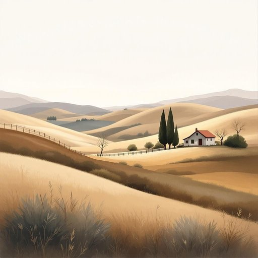

# painting

<h1 style="font-size: 2.5em; font-weight: 300; letter-spacing: 2px; margin: 0; color: #2c3e50;">
/ˈpeɪnɪŋ/
</h1>

---

---

## 例句

The painting that we picked up at the local market last summer, which features a vibrant countryside scene with rolling hills and a rustic cottage, has completely transformed the living room by adding a splash of colour and character, making it feel far more inviting than before.

*The(/ðə/) painting(/ˈpeɪnɪŋ/) that(/ðət/) we(/wi/) picked(/pɪkt/) up(/əp/) at(/æt/) the(/ðə/) local(/ˈloʊkəl/) market(/ˈmɑrkɪt/) last(/læst/) summer,(/ˈsəmər,/) which(/wɪʧ/) features(/ˈfiʧərz/) a(/ə/) vibrant(/ˈvaɪbrənt/) countryside(/ˈkəntriˌsaɪd/) scene(/sin/) with(/wɪθ/) rolling(/ˈroʊlɪŋ/) hills(/hɪlz/) and(/ənd/) a(/ə/) rustic(/ˈrəstɪk/) cottage,(/ˈkɑtɪʤ,/) has(/həz/) completely(/kəmˈplitli/) transformed(/trænsˈfɔrmd/) the(/ðə/) living(/ˈlɪvɪŋ/) room(/rum/) by(/baɪ/) adding(/ˈædɪŋ/) a(/ə/) splash(/splæʃ/) of(/əv/) colour(/ˈkələr/) and(/ənd/) character,(/ˈkɛrɪktər,/) making(/ˈmeɪkɪŋ/) it(/ɪt/) feel(/fil/) far(/fɑr/) more(/mɔr/) inviting(/ˌɪnˈvaɪtɪŋ/) than(/ðən/) before.(/ˌbiˈfɔr./)*

**翻译：** 我们去年夏天在当地市场买的那幅画，描绘了一幅生动的乡村景象，有连绵起伏的山丘和一座质朴的小屋，彻底改变了客厅的氛围，增添了一抹色彩和个性，使整个空间比以前更加温馨宜人。

---

## 解释

英语单词“painting”作为名词，在家居生活用品的语境中，通常指挂在墙上作为装饰的画作，如油画、水彩画或印刷复制品，常见于客厅、卧室或办公室的墙面装饰，使用场合包括布置家居环境、提升空间美感或作为艺术收藏展示。学习者需注意“painting”作为可数名词时通常用复数形式“paintings”表示多幅画作，且前面常用定冠词the或指示代词this、that修饰，而在表达“绘画这一艺术形式”时，“painting”则不可数。此外，常见搭配有“一幅某艺术家的画”、“挂画”、“油画”、“风景画”等，表达需结合具体语境以区分作品与动作。词源方面，“painting”源自古法语“peint”或拉丁语“pingere”，意指“涂抹、描绘”，起初指绘画动作，后引申为所完成的图画作品。在中文语境中，“painting”对应的准确翻译为“画作”或“绘画作品”，侧重于实物的艺术品含义，无特殊褒贬色彩，属于中性词，文化内涵涉及艺术鉴赏和审美价值，是家居美化的重要元素。

---

<small style="color: #999; font-size: 0.9em;">2025-07-27 09:14:04</small>

