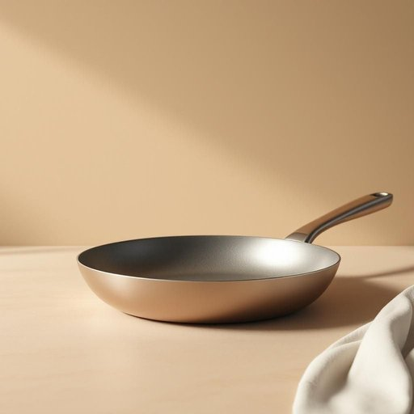

# pan

<h1 style="font-size: 2.5em; font-weight: 300; letter-spacing: 2px; margin: 0; color: #2c3e50;">
/pæn/
</h1>

---

---

## 例句

Could you please wash the pan that has the burnt bits from last night’s stew, the large frying pan with the non-stick coating that Mum always insists we use to prevent food from sticking and to make cleaning up easier?

*Could(/kʊd/) you(/ju/) please(/pliz/) wash(/wɑʃ/) the(/ðə/) pan(/pæn/) that(/ðət/) has(/həz/) the(/ðə/) burnt(/bərnt/) bits(/bɪts/) from(/frəm/) last(/læst/) night’s(/night’s*/) stew,(/stu,/) the(/ðə/) large(/lɑrʤ/) frying(/fraɪɪŋ/) pan(/pæn/) with(/wɪθ/) the(/ðə/) non-stick(/nɑnˈstɪk/) coating(/ˈkoʊtɪŋ/) that(/ðət/) Mum(/məm/) always(/ˈɔlˌweɪz/) insists(/ˌɪnˈsɪsts/) we(/wi/) use(/juz/) to(/tɪ/) prevent(/prɪˈvɛnt/) food(/fud/) from(/frəm/) sticking(/ˈstɪkɪŋ/) and(/ənd/) to(/tɪ/) make(/meɪk/) cleaning(/ˈklinɪŋ/) up(/əp/) easier?(/ˈiziər?/)*

**翻译：** 你能帮忙把昨晚炖菜锅里焦糊的部分洗干净吗？就是那个大号的不粘煎锅，妈妈一直坚持用它，因为它能防止食物粘锅，也更方便清洗。

---

## 解释

英语单词“pan”在家居生活用品场景中作为名词，主要指“平底锅”或“锅具”，通常用于烹饪时盛放或加热食物。具体使用场合包括厨房烹饪、食物准备或餐具讨论中，例如“frying pan”（煎锅）、“saucepan”（炖锅）等。英语学习者在使用时应注意“pan”一般是可数名词，常与形容词或描述性词汇连用，形成复合词或固定搭配，如“non-stick pan”（不粘锅）、“baking pan”（烤盘），这类搭配表达更为准确；另外，复数形式为“pans”。词源方面，“pan”来源于古英语“panna”，其根源可追溯至拉丁语“patina”，意指浅盘或浅锅，反映其浅口、方便烹饪的形态特征。在中文语境中，“pan”准确的翻译通常是“锅”或“平底锅”，根据具体类型可译作“煎锅”、“炒锅”、“烤盘”等，有助于区分不同用途和形状。需要注意的是，“pan”作为名词在家居用品中一般无褒贬色彩，属于中性词汇，但在口语或俚语中也可引申为“严厉批评”（如“to pan a movie”），此时含义完全不同，使用时需根据语境辨别。总体而言，“pan”作为烹饪器具名词时，其文化内涵主要围绕日常厨房活动，体现生活实用性和饮食文化。

---

<small style="color: #999; font-size: 0.9em;">2025-07-27 09:14:04</small>

