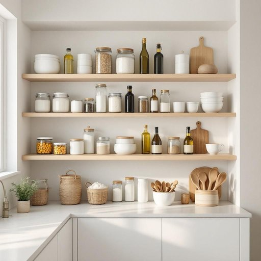

# pantry

<h1 style="font-size: 2.5em; font-weight: 300; letter-spacing: 2px; margin: 0; color: #2c3e50;">
/ˈpæntri/
</h1>

---

---

## 例句

Before we start preparing dinner, could you please check the pantry, where we usually keep the canned goods, spices, and extra baking supplies, to see if we still have enough olive oil and flour, as I want to make sure we’re fully stocked for the weekend?

*Before(/ˌbiˈfɔr/) we(/wi/) start(/stɑrt/) preparing(/pərˈpɛrɪŋ/) dinner,(/ˈdɪnər,/) could(/kʊd/) you(/ju/) please(/pliz/) check(/ʧɛk/) the(/ðə/) pantry,(/ˈpæntri,/) where(/wɛr/) we(/wi/) usually(/ˈjuʒəwəli/) keep(/kip/) the(/ðə/) canned(/kænd/) goods,(/gʊdz,/) spices,(/ˈspaɪsɪz,/) and(/ənd/) extra(/ˈɛkstrə/) baking(/ˈbeɪkɪŋ/) supplies,(/səˈplaɪz,/) to(/tɪ/) see(/si/) if(/ɪf/) we(/wi/) still(/stɪl/) have(/hæv/) enough(/ɪˈnəf/) olive(/ˈɑlɪv/) oil(/ɔɪl/) and(/ənd/) flour,(/flaʊər,/) as(/ɛz/) I(/aɪ/) want(/wɔnt/) to(/tɪ/) make(/meɪk/) sure(/ʃʊr/) we’re(/we’re*/) fully(/ˈfʊli/) stocked(/stɑkt/) for(/fər/) the(/ðə/) weekend?(/ˈwiˌkɪnd?/)*

**翻译：** 在我们开始准备晚餐之前，能否请你去储藏室看看，那是我们通常放罐头、香料和额外烘焙材料的地方，确认一下橄榄油和面粉是否还够用？我想确保我们周末的储备充足。

---

## 解释

“pantry”作为名词在家居生活用品的语境中，指的是储藏食品、餐具或厨房用品的小储藏室或储藏柜，通常位于厨房或餐厅附近，用于存放干货、罐头、调料等非易腐食品。使用场合多为家庭住宅、餐馆或家庭式餐厅环境，语境上常涉及厨房收纳和食品保存。英语学习者在使用“pantry”时应注意其为可数名词，单复数形式分别为“pantry”和“pantries”，且常与动词“store”（储藏）、“stock”（囤积）、“organize”（整理）等搭配，如“stock the pantry”表示“囤积储藏室的食物”。此外，短语“walk-in pantry”指较大、可步入的储藏室，是常见固定表达。词源上，“pantry”源于中古英语“paneterie”，意指面包和食物的储藏室，进一步追溯到古法语“paneterie”，源于拉丁语“panis”意为面包，这反映了其最初主要用于存放面包的功能。中文中，“pantry”通常准确翻译为“食品储藏室”或“储藏室”，强调其专门用于储存食品和厨房用品的功能，不应简单理解为普通储物间。该词在英语中没有明显的褒贬色彩，属于中性词，但在现代居家设计语境下，“pantry”往往暗示较为整洁、有序且功能齐全的储藏空间，带有一定的便利和舒适感文化内涵。

---

<small style="color: #999; font-size: 0.9em;">2025-07-27 09:14:04</small>

