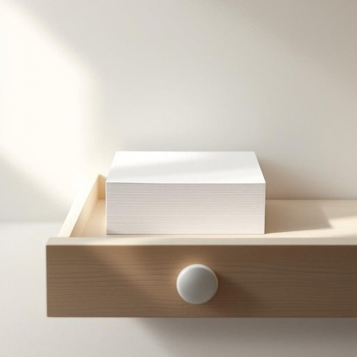

# paper

<h1 style="font-size: 2.5em; font-weight: 300; letter-spacing: 2px; margin: 0; color: #2c3e50;">
/ˈpeɪpər/
</h1>

---

---

## 例句

Could you please check if the paper in the kitchen drawer, which we usually use for jotting down shopping lists and reminders, is running low because I want to make sure we don’t run out before the busy weekend?

*Could(/kʊd/) you(/ju/) please(/pliz/) check(/ʧɛk/) if(/ɪf/) the(/ðə/) paper(/ˈpeɪpər/) in(/ɪn/) the(/ðə/) kitchen(/ˈkɪʧən/) drawer,(/drɔr,/) which(/wɪʧ/) we(/wi/) usually(/ˈjuʒəwəli/) use(/juz/) for(/fər/) jotting(/jotting*/) down(/daʊn/) shopping(/ˈʃɑpɪŋ/) lists(/lɪsts/) and(/ənd/) reminders,(/riˈmaɪndərz,/) is(/ɪz/) running(/ˈrənɪŋ/) low(/loʊ/) because(/bɪˈkəz/) I(/aɪ/) want(/wɔnt/) to(/tɪ/) make(/meɪk/) sure(/ʃʊr/) we(/wi/) don’t(/don’t*/) run(/rən/) out(/aʊt/) before(/ˌbiˈfɔr/) the(/ðə/) busy(/ˈbɪzi/) weekend?(/ˈwiˌkɪnd?/)*

**翻译：** 你能帮忙看看厨房抽屉里的纸张是否快用完了吗？那是我们平时用来写购物清单和提醒事项的，我想确保在忙碌的周末到来之前不会用光。

---

## 解释

英语单词“paper”作为名词在家居生活用品的语境中，通常指用来书写、打印、包裹或清洁的纸张，比如书写纸、打印纸、包装纸、厨房用纸（paper towel）等，具体使用场合包括家庭办公、做手工、包装礼物或厨房清洁等日常情景。英语学习者在使用“paper”时需注意其不可数与可数的区别，通常纸张作为整体是不计数的不可数名词，但当特指一张或几张纸时，可用复数“papers”；此外，“paper”常与量词连用，如a sheet of paper（一张纸）、a roll of paper（一卷纸）、paper towels（厨房用纸），且可与形容词连用来明确用途或材质，如“writing paper”（写字纸）、“wrapping paper”（包装纸）。词源方面，“paper”源自拉丁语“papyrus”，指古埃及用来书写的莎草纸，经过演变指代现代的纸张材料。中文语境中，“paper”作为家居用品主要准确翻译为“纸”或“纸张”，依据具体用途也可译为“厨房用纸”、“卫生纸”等，该词一般无褒贬色彩，属于中性词，但在文化语境中纸张的不同用途和种类可能带有特定社会象征，例如正式文件用的纸常体现权威性，而一次性纸巾更多关联生活便利性。整体而言，“paper”在家居生活中代表一种常见且功能多样的材料，是学习英语时不可忽视的基础词汇。

---

<small style="color: #999; font-size: 0.9em;">2025-07-27 09:14:04</small>

