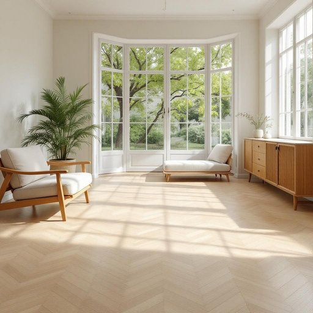

# parquet

<h1 style="font-size: 2.5em; font-weight: 300; letter-spacing: 2px; margin: 0; color: #2c3e50;">
/pɑrˈkeɪ/
</h1>

---

---

## 例句

After the decision to renovate the living room, the choice of a classic oak parquet as the flooring brought not only warmth and elegance but also a perfect complement to the vintage furniture and the large bay window that floods the entire space with natural light.

*After(/ˈæftər/) the(/ðə/) decision(/dɪˈsɪʒən/) to(/tɪ/) renovate(/ˈrɛnəˌveɪt/) the(/ðə/) living(/ˈlɪvɪŋ/) room,(/rum,/) the(/ðə/) choice(/ʧɔɪs/) of(/əv/) a(/ə/) classic(/ˈklæsɪk/) oak(/oʊk/) parquet(/pɑrˈkeɪ/) as(/ɛz/) the(/ðə/) flooring(/ˈflɔrɪŋ/) brought(/brɔt/) not(/nɑt/) only(/ˈoʊnli/) warmth(/wɔrmθ/) and(/ənd/) elegance(/ˈɛləgəns/) but(/bət/) also(/ˈɔlsoʊ/) a(/ə/) perfect(/ˈpərˌfɪkt/) complement(/ˈkɑmpləmənt/) to(/tɪ/) the(/ðə/) vintage(/ˈvɪntɪʤ/) furniture(/ˈfərnɪʧər/) and(/ənd/) the(/ðə/) large(/lɑrʤ/) bay(/beɪ/) window(/ˈwɪndoʊ/) that(/ðət/) floods(/flədz/) the(/ðə/) entire(/ɪnˈtaɪər/) space(/speɪs/) with(/wɪθ/) natural(/ˈnæʧərəl/) light.(/laɪt./)*

**翻译：** 在决定翻新客厅后，选择经典橡木拼花地板不仅带来了温暖与优雅，还与复古家具及那扇将自然光洒满整个空间的大飘窗完美呼应。

---

## 解释

英语单词“parquet”作为名词，在家居生活用品的语境中主要指由小块木材组成的镶嵌地板，即“拼花地板”或“镶木地板”。它通常用于描述客厅、走廊或大厅等室内空间的装饰性地面铺设，既具有美观性又具备实用性，常见于较为高档或复古风格的住宅与公共建筑。在英语学习中，使用“parquet”时需注意其不可数名词属性，通常不直接加复数形式，但有时也见到“parquets”用于指多个不同地方的拼花地板。常见搭配有“parquet floor”（拼花木地板）、“parquet flooring”（镶木地板材料）以及动词短语“lay parquet”（铺设拼花地板），句中多作为名词使用，语法上与其它具体名称类似。此外，“parquet”在非家居语境中还可指“检察院”或“法庭”，但在家居领域无此含义。词源方面，该词来自法语“parquet”，原意为“小护栏”或“围栏”，后来引申为剧院内部被栏杆围起的核心观众席区域，再引申为由小木块围成的地板，体现了其拼接成格状结构的特征。在中文语境中，“parquet”准确翻译为“拼花地板”或“镶木地板”，强调木地板由多片木块按特定图案排列拼接而成，区别于实木地板或复合木地板。该词本身无褒贬色彩，但因其代表较传统、精致的装饰方式，常带有优雅、品质生活的文化内涵，使用时可体现讲究和品味。

---

<small style="color: #999; font-size: 0.9em;">2025-07-27 09:14:04</small>

