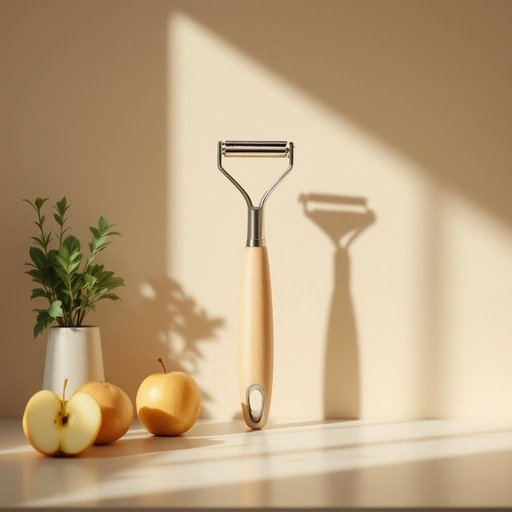

# peeler

<h1 style="font-size: 2.5em; font-weight: 300; letter-spacing: 2px; margin: 0; color: #2c3e50;">
/ˈpilər/
</h1>

---

---

## 例句

When discussing the importance of trust in any relationship, it’s essential to remember that trust is not simply given but earned through consistent honesty, reliability, and open communication, which ultimately forms the foundation for lasting bonds between people.

*When(/wɪn/) discussing(/dɪˈskəsɪŋ/) the(/ðə/) importance(/ˌɪmˈpɔrtəns/) of(/əv/) trust(/trəst/) in(/ɪn/) any(/ˈɛni/) relationship,(/riˈleɪʃənˌʃɪp,/) it’s(/it’s*/) essential(/ɛˈsɛnʃəl/) to(/tɪ/) remember(/rɪˈmɛmbər/) that(/ðət/) trust(/trəst/) is(/ɪz/) not(/nɑt/) simply(/ˈsɪmpli/) given(/ˈgɪvɪn/) but(/bət/) earned(/ərnd/) through(/θru/) consistent(/kənˈsɪstənt/) honesty,(/ˈɑnəsti,/) reliability,(/riˌlaɪəˈbɪləti,/) and(/ənd/) open(/ˈoʊpən/) communication,(/kəmˌjunəˈkeɪʃən,/) which(/wɪʧ/) ultimately(/ˈəltəmətli/) forms(/fɔrmz/) the(/ðə/) foundation(/faʊnˈdeɪʃən/) for(/fər/) lasting(/ˈlæstɪŋ/) bonds(/bɑndz/) between(/bɪtˈwin/) people.(/ˈpipəl./)*

**翻译：** 在谈及信任在任何关系中的重要性时，必须牢记，信任并非轻易给予，而是通过持续的诚信、可靠和开放的沟通赢得的，这最终构筑了人与人之间持久纽带的基础。

---

## 解释

“peeler”作为家居生活用品名词时，主要指用于削皮的工具，特别是蔬菜或水果削皮器，常见于厨房环境中。具体使用场合一般是在烹饪准备食材时，比如削土豆、胡萝卜或苹果等蔬果的外皮，其语境多为家庭厨房对话、菜谱说明或厨具购买指南。英语学习者在使用该词时需注意，“peeler”在此语境中是可数名词，通常以单数或复数形式出现，常见搭配包括“a vegetable peeler”（一个蔬菜削皮器）、“potato peeler”（土豆削皮器）以及“fruit peeler”（水果削皮器）。表达技巧方面，学习者应了解该词多用于具体物品，而不是抽象概念，因此常与具体的蔬果搭配使用。此外，“peeler”还有另外一种含义指“警察”（尤其在英国口语中），这点需避免混淆。词源上，“peeler”源自动词“peel”，意为“剥皮”，后加名词后缀“-er”，表示执行剥皮动作的工具或人。其原始用法直接指“剥皮者”，引申为用于剥皮的工具。中文语境中，准确翻译通常为“削皮器”或“削皮刀”，强调其家居厨房工具属性。需要注意的是，除厨房工具含义外，该词没有特别的褒贬色彩或文化内涵，在正式和口语中均可使用，但应根据语境避免与“警察”的俚语用法混淆。总之，“peeler”在家居生活用品语境中是指用于削除果蔬外皮的工具，语法上作为名词使用，搭配具体食材名词较多，源于“剥皮”的动作，中文中对应“削皮器”，是厨房中常见的实用器具。

---

<small style="color: #999; font-size: 0.9em;">2025-07-27 09:14:04</small>

