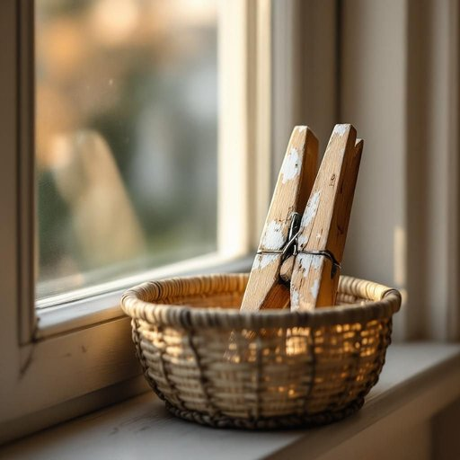

# peg

<h1 style="font-size: 2.5em; font-weight: 300; letter-spacing: 2px; margin: 0; color: #2c3e50;">
/pɛg/
</h1>

---

---

## 例句

Could you please pass me a wooden peg from the basket on the windowsill, the one with the chipped paint, so I can hang the damp washing on the line before it starts raining again?

*Could(/kʊd/) you(/ju/) please(/pliz/) pass(/pæs/) me(/mi/) a(/ə/) wooden(/ˈwʊdən/) peg(/pɛg/) from(/frəm/) the(/ðə/) basket(/ˈbæskət/) on(/ɔn/) the(/ðə/) windowsill,(/windowsill*,/) the(/ðə/) one(/wən/) with(/wɪθ/) the(/ðə/) chipped(/ʧɪpt/) paint,(/peɪnt,/) so(/soʊ/) I(/aɪ/) can(/kən/) hang(/hæŋ/) the(/ðə/) damp(/dæmp/) washing(/ˈwɑʃɪŋ/) on(/ɔn/) the(/ðə/) line(/laɪn/) before(/ˌbiˈfɔr/) it(/ɪt/) starts(/stɑrts/) raining(/ˈreɪnɪŋ/) again?(/əˈgɛn?/)*

**翻译：** 请你帮我从窗台上的篮子里递给我一个木制夹子，就是那个漆面剥落的，我好把湿衣服挂到绳子上，趁着天又要下雨之前。

---

## 解释

单词“peg”作为名词在家居生活用品的语境中，通常指小钉子、小夹子或衣夹，用来固定、悬挂或支撑衣物、布料等。例如，洗衣时用的晾衣夹常被称为“peg”，也可以指挂钩或墙上的小钉子，用于挂帽子、衣服等物品。这一用法常见于日常生活，如“cloth peg”（衣夹）、“wall peg”（墙钉）。英语学习者需要注意“peg”作为可数名词使用时，其复数形式为“pegs”，且常与具体物件搭配，如cloth peg、tent peg（帐篷钉）等。在表达技巧上，可以用动词短语“hang on a peg”表达“挂在钉子上”，或用“put a peg in”表示“插入钉子”。词源上，“peg”源自中古英语“pegge”，起源于古挪威语“paggi”，本意为插入或固定的小木棍，反映了其固定和支撑的基本功能。在中文语境中，peg一般译为“钉子”、“衣夹”或“夹子”，具体翻译根据上下文有所不同，需结合实际使用场合来理解。该词在家居环境中多为中性词汇，无褒贬含义，且因其简单实用，常见于非正式和口语中，反映出日常生活的实用工具属性。

---

<small style="color: #999; font-size: 0.9em;">2025-07-27 09:14:04</small>

