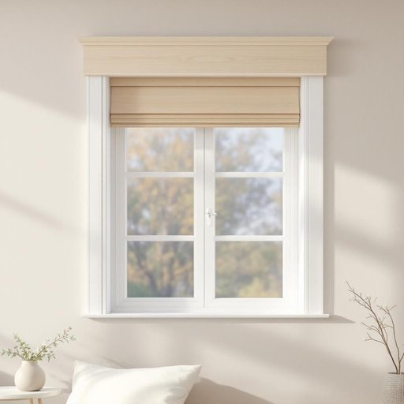

# pelmet

<h1 style="font-size: 2.5em; font-weight: 300; letter-spacing: 2px; margin: 0; color: #2c3e50;">
/pelmet*/
</h1>

---

---

## 例句

Could you please take down the pelmet from the living room window before the decorators arrive tomorrow, since it not only conceals the curtain fittings elegantly but also helps to insulate the room against draughts during the colder months?

*Could(/kʊd/) you(/ju/) please(/pliz/) take(/teɪk/) down(/daʊn/) the(/ðə/) pelmet(/pelmet*/) from(/frəm/) the(/ðə/) living(/ˈlɪvɪŋ/) room(/rum/) window(/ˈwɪndoʊ/) before(/ˌbiˈfɔr/) the(/ðə/) decorators(/ˈdɛkərˌeɪtərz/) arrive(/əraɪv/) tomorrow,(/təˈmɑˌroʊ,/) since(/sɪns/) it(/ɪt/) not(/nɑt/) only(/ˈoʊnli/) conceals(/kənˈsilz/) the(/ðə/) curtain(/ˈkərtən/) fittings(/ˈfɪtɪŋz/) elegantly(/ˈɛlɪgənˌtli/) but(/bət/) also(/ˈɔlsoʊ/) helps(/hɛlps/) to(/tɪ/) insulate(/ˈɪnsəˌleɪt/) the(/ðə/) room(/rum/) against(/əˈgɛnst/) draughts(/dræfts/) during(/ˈdʊrɪŋ/) the(/ðə/) colder(/ˈkoʊldər/) months?(/mənθs?/)*

**翻译：** 请您在明天装修工人到来之前，将客厅窗户上的窗帘箱取下，因为它不仅能优雅地遮盖窗帘配件，还能在寒冷季节帮助隔绝冷风。

---

## 解释

英语单词“pelmet”在家居生活用品语境中作为名词，指的是固定在窗帘顶部、覆盖窗帘轨道或杆部的装饰性木质或织物包边条，主要作用是遮盖窗帘机械部分，使窗口整体更美观，同时也能一定程度上防止光线从窗帘头部透入。通常出现在室内装修、窗帘设计和家具陈设的讨论中，是窗帘装饰的重要元素。学习者在使用“pelmet”时应注意其为可数名词，常见搭配包括“window pelmet”（窗户帘头）、“fabric pelmet”（织物帘头）和“wooden pelmet”（木制帘头），表达时宜用定冠词the指明特定窗帘头，或使用形容词限定其材质及风格。此外，pelmet多用于正式及专业装修语境，日常对话中较少提及。该词源自中古法语“palmette”，意指小棕榈叶状装饰物，后来演变为指窗帘上方的装饰边板。中文语境中，“pelmet”可准确翻译为“窗帘箱”或“窗幔板”，强调其装饰和遮挡功能，属于家居装修专业术语，使用时应避免混淆普通窗帘或窗帘杆。此词无明显褒贬色彩，也无特殊文化隐喻，主要体现家居审美与功能的结合。

---

<small style="color: #999; font-size: 0.9em;">2025-07-27 09:14:04</small>

