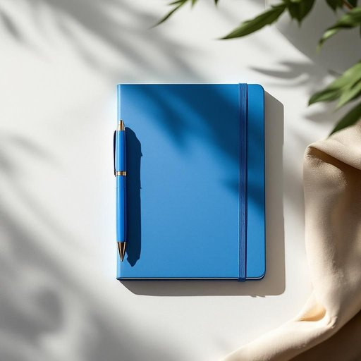

# pen

<h1 style="font-size: 2.5em; font-weight: 300; letter-spacing: 2px; margin: 0; color: #2c3e50;">
/pɛn/
</h1>

---

---

## 例句

Could you please hand me the blue pen that’s lying next to the notepad on the kitchen table, the one with the slightly worn-out cap which I always use to jot down grocery lists and reminder notes for the week?

*Could(/kʊd/) you(/ju/) please(/pliz/) hand(/hænd/) me(/mi/) the(/ðə/) blue(/blu/) pen(/pɛn/) that’s(/that’s*/) lying(/laɪɪŋ/) next(/nɛkst/) to(/tɪ/) the(/ðə/) notepad(/notepad*/) on(/ɔn/) the(/ðə/) kitchen(/ˈkɪʧən/) table,(/ˈteɪbəl,/) the(/ðə/) one(/wən/) with(/wɪθ/) the(/ðə/) slightly(/sˈlaɪtli/) worn-out(/worn-out*/) cap(/kæp/) which(/wɪʧ/) I(/aɪ/) always(/ˈɔlˌweɪz/) use(/juz/) to(/tɪ/) jot(/ʤɑt/) down(/daʊn/) grocery(/ˈgroʊsəri/) lists(/lɪsts/) and(/ənd/) reminder(/riˈmaɪndər/) notes(/noʊts/) for(/fər/) the(/ðə/) week?(/wik?/)*

**翻译：** 请把厨房桌子上记事本旁边那支蓝色的笔递给我，就是那支笔盖稍微有些磨损的，我平时常用它来写购物清单和本周的备忘录。

---

## 解释

英语单词“pen”作为名词在家居生活用品场景中，通常指的是用于书写的“钢笔”或“圆珠笔”等书写工具，常见于家庭、办公室、学校等环境，使用时包括写字、做笔记、签字等具体活动。英语学习者应注意“pen”作为可数名词，复数形式为“pens”，同时常见搭配有“a pen and paper”（一支笔和纸）、“ballpoint pen”（圆珠笔）、“fountain pen”（钢笔），以及表达如“to borrow a pen”（借笔）、“to lose one's pen”（丢笔）等，使用时需区分其与“pencil”（铅笔）等其他书写工具的区别。词源方面，“pen”一词来源于拉丁语“penna”，意为“羽毛”，最初指用羽毛制作的笔，后演变为现代各种书写工具名称。在中文语境中，“pen”准确翻译为“笔”，特指可用以书写的工具，但不包括如毛笔等特定文化工具。该词在日常生活中无褒贬含义，属于中性词汇，纯粹描述工具性质，且文化内涵简单直接，学习时重点在于熟记其基本含义及词形变化即可。

---

<small style="color: #999; font-size: 0.9em;">2025-07-27 09:14:04</small>

