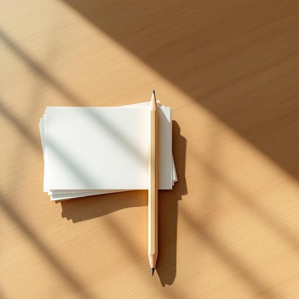

# pencil

<h1 style="font-size: 2.5em; font-weight: 300; letter-spacing: 2px; margin: 0; color: #2c3e50;">
/ˈpɛnsəl/
</h1>

---

---

## 例句

Could you please hand me the pencil that’s lying next to the stack of unopened letters on the kitchen table, as I need to jot down a quick note before the delivery arrives?

*Could(/kʊd/) you(/ju/) please(/pliz/) hand(/hænd/) me(/mi/) the(/ðə/) pencil(/ˈpɛnsəl/) that’s(/that’s*/) lying(/laɪɪŋ/) next(/nɛkst/) to(/tɪ/) the(/ðə/) stack(/stæk/) of(/əv/) unopened(/əˈnoʊpənd/) letters(/ˈlɛtərz/) on(/ɔn/) the(/ðə/) kitchen(/ˈkɪʧən/) table,(/ˈteɪbəl,/) as(/ɛz/) I(/aɪ/) need(/nid/) to(/tɪ/) jot(/ʤɑt/) down(/daʊn/) a(/ə/) quick(/kwɪk/) note(/noʊt/) before(/ˌbiˈfɔr/) the(/ðə/) delivery(/dɪˈlɪvəri/) arrives?(/əraɪvz?/)*

**翻译：** 请你帮我拿一下厨房桌子上那堆未打开信件旁边的铅笔吗？我需要在快递到来之前记下一条简短的便条。

---

## 解释

单词“pencil”作为名词在家居生活用品的语境中，通常指用于写字或绘画的一种细长木制或塑料制成的书写工具，内部含有石墨芯，使用时通过在纸张等表面摩擦留下痕迹，具体使用场合多见于家庭书桌、学习区或办公场所。英语学习者使用“pencil”时，应注意其基本语法属性为可数名词，复数形式为“pencils”，常见搭配有“a pencil case”（铅笔盒）、“sharpen a pencil”（削铅笔）、“pencil sharpener”（卷笔刀），表达时可用“write/draw with a pencil”来描述使用方式。词源方面，“pencil”起源于拉丁语“penicillus”，意为“细刷子”，经过中古英语演变，演变成现代指代细长的书写工具，这也反映了其早期形态类似细刷子的历史。中文语境中，“pencil”通常准确翻译为“铅笔”，注意其与“pen”（钢笔、圆珠笔）区分，不带有特殊褒贬意义，也没有明显的文化色彩，但在教育和生活中象征着学习和创作的工具，是较为中性且常用的词汇。

---

<small style="color: #999; font-size: 0.9em;">2025-07-27 09:14:04</small>

