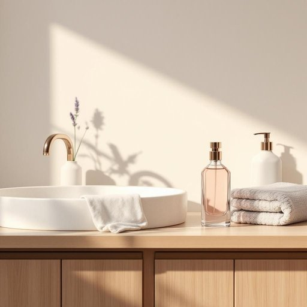

# perfume

<h1 style="font-size: 2.5em; font-weight: 300; letter-spacing: 2px; margin: 0; color: #2c3e50;">
/pərfˈjum/
</h1>

---

---

## 例句

Could you please pass me the lavender-scented perfume that’s sitting next to the hand soap on the bathroom sink, as I want to freshen up the guest room before our friends arrive this evening?

*Could(/kʊd/) you(/ju/) please(/pliz/) pass(/pæs/) me(/mi/) the(/ðə/) lavender-scented(/lavender-scented*/) perfume(/pərfˈjum/) that’s(/that’s*/) sitting(/ˈsɪtɪŋ/) next(/nɛkst/) to(/tɪ/) the(/ðə/) hand(/hænd/) soap(/soʊp/) on(/ɔn/) the(/ðə/) bathroom(/ˈbæθˌrum/) sink,(/sɪŋk,/) as(/ɛz/) I(/aɪ/) want(/wɔnt/) to(/tɪ/) freshen(/ˈfrɛʃən/) up(/əp/) the(/ðə/) guest(/gɛst/) room(/rum/) before(/ˌbiˈfɔr/) our(/ɑr/) friends(/frɛndz/) arrive(/əraɪv/) this(/ðɪs/) evening?(/ˈivnɪŋ?/)*

**翻译：** 请帮我拿一下放在浴室洗手池上、皂液旁边的薰衣草香水，我想在朋友们今晚来之前先给客房清新一下空气。

---

## 解释

英语单词“perfume”作为名词在家居生活用品语境中，通常指用来散发香气、改善居室空气的香水或芳香剂，具体使用场合包括喷洒在衣物、空气或布料上以营造宜人气味，如家用室内香水、空气清新剂等。英语学习者需注意，“perfume”作为名词常用不可数形式表示香水的整体概念，但也可作可数名词指一瓶香水或一种香型（例如a perfume），其常见搭配有“apply perfume”（喷香水）、“a bottle of perfume”（一瓶香水）、“floral perfume”（花香型香水）等。此外，perfume也可作动词，表示“给……喷香水”或“使充满香气”。该词源自拉丁语“perfumare”，意为“通过烟熏”或“用烟熏香料”，由“per-”（穿过）和“fumare”（冒烟）构成，历史上指用烟熏香料产生芳香，逐渐引申至现代香水的含义。在中文语境中，perfume通常翻译为“香水”或“香味”，在家居用品语境中多指“室内香水”或“香氛”，强调其提升环境气味的功能，通常不含贬义，反映的是一种美化生活环境、提升生活品质的积极文化内涵。

---

<small style="color: #999; font-size: 0.9em;">2025-07-27 09:14:04</small>

