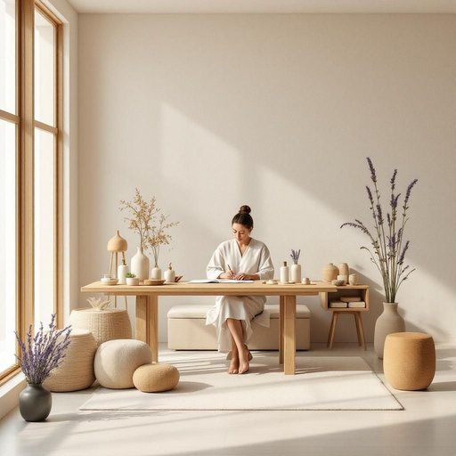

# perfumer

<h1 style="font-size: 2.5em; font-weight: 300; letter-spacing: 2px; margin: 0; color: #2c3e50;">
/perfumer*/
</h1>

---

---

## 例句

Although the perfumer’s latest home fragrance collection masterfully combines subtle hints of lavender and sandalwood, its complexity and depth make it the centerpiece that transforms any living room into a serene sanctuary ideal for relaxation.

*Although(/ˌɔlˈðoʊ/) the(/ðə/) perfumer’s(/perfumer’s*/) latest(/ˈleɪtəst/) home(/hoʊm/) fragrance(/ˈfreɪgrəns/) collection(/kəˈlɛkʃən/) masterfully(/ˈmæstərfəli/) combines(/kəmˈbaɪnz/) subtle(/ˈsətəl/) hints(/hɪnts/) of(/əv/) lavender(/ˈlævəndər/) and(/ənd/) sandalwood,(/sandalwood*,/) its(/ɪts/) complexity(/kəmˈplɛksɪti/) and(/ənd/) depth(/dɛpθ/) make(/meɪk/) it(/ɪt/) the(/ðə/) centerpiece(/ˈsɛntərˌpis/) that(/ðət/) transforms(/trænsˈfɔrmz/) any(/ˈɛni/) living(/ˈlɪvɪŋ/) room(/rum/) into(/ˈɪntu/) a(/ə/) serene(/sərˈin/) sanctuary(/ˈsæŋkʧuˌɛri/) ideal(/aɪˈdil/) for(/fər/) relaxation.(/ˌrilækˈseɪʃən./)*

**翻译：** 虽然这位调香师最新的家居香氛系列巧妙地融合了淡雅的薰衣草与檀香，但其丰富的层次与深度，使其成为点亮任何客厅的核心，营造出理想的宁静圣地，助人放松身心。

---

## 解释

英语单词“perfumer”在家居生活用品语境中作为名词，指的是“调香师”或“香水制造者”，即专业从事香水、香料配制和生产的人。具体使用场合通常涉及香水品牌、化妆品公司、香氛设计或家用香氛制品的开发领域，例如描述一位在香水品牌工作的专业人员，或家居香氛产品背后的创作者。英语学习者使用该词时应注意“perfumer”为可数名词，复数形式为“perfumers”，通常与动词连用表示职业身份或行为，如“a famous perfumer”（著名的调香师），“the perfumer creates a new scent”（调香师创作了一种新香味），此外常见搭配有“master perfumer”“professional perfumer”等，表达其专业性和资历。词源方面，“perfumer”源自古法语“parfumer”及拉丁语“per fumum”，意指“通过烟雾散发香气”，反映了早期用香料熏香的传统。中文语境中，“perfumer”应准确翻译为“调香师”，表明其作为专业人士的身份，而非泛指香水本身或使用者，没有褒贬色彩，只是职业称谓，文化上与香水工业和香氛艺术密切相关，代表着创意与技艺的结合，是香氛产品背后的重要角色。

---

<small style="color: #999; font-size: 0.9em;">2025-07-27 09:14:04</small>

