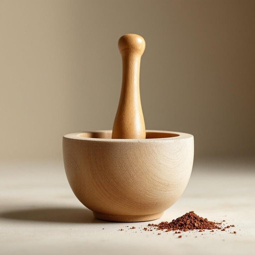

# pestle

<h1 style="font-size: 2.5em; font-weight: 300; letter-spacing: 2px; margin: 0; color: #2c3e50;">
/pestle*/
</h1>

---

---

## 例句

When the archaeologist carefully examined the pestle found among the temple ruins, she realized it was an indispensable tool used by ancient civilizations to grind medicinal herbs and spices, playing a crucial role in their daily rituals and culinary practices.

*When(/wɪn/) the(/ðə/) archaeologist(/ˌɑrkiˈɑləʤɪst/) carefully(/ˈkɛrfəli/) examined(/ɪgˈzæmənd/) the(/ðə/) pestle(/pestle*/) found(/faʊnd/) among(/əˈməŋ/) the(/ðə/) temple(/ˈtɛmpəl/) ruins,(/ruɪnz,/) she(/ʃi/) realized(/ˈriəˌlaɪzd/) it(/ɪt/) was(/wɑz/) an(/ən/) indispensable(/ˌɪndɪˈspɛnsəbəl/) tool(/tul/) used(/juzd/) by(/baɪ/) ancient(/ˈeɪnʧənt/) civilizations(/ˌsɪvəlɪˈzeɪʃənz/) to(/tɪ/) grind(/graɪnd/) medicinal(/məˈdɪsənəl/) herbs(/ərbz/) and(/ənd/) spices,(/ˈspaɪsɪz,/) playing(/pleɪɪŋ/) a(/ə/) crucial(/ˈkruʃəl/) role(/roʊl/) in(/ɪn/) their(/ðɛr/) daily(/ˈdeɪli/) rituals(/ˈrɪʧuəlz/) and(/ənd/) culinary(/ˈkjulɪˌnɛri/) practices.(/ˈpræktɪsɪz./)*

**翻译：** 当考古学家细致地检查寺庙遗址中发现的杵时，她意识到这是一件古代文明用于研磨药草和香料的必备工具，在他们的日常仪式和烹饪活动中发挥着重要作用。

---

## 解释

英语单词“pestle”作为名词，常见于家居生活用品领域，指的是研钵中用来捣碎、研磨食材或药材的杵，通常为坚硬材料制成，如木头、石头或陶瓷，使用时配合研钵将香料、草药等压碎以便烹饪或药用。具体使用场合通常是在厨房或草药配制中，比如“Use the pestle to grind the peppercorns”（用杵研磨胡椒粒），强调的是手工研磨的动作和工具。英语学习者在使用“pestle”时需注意它是可数名词，通常与冠词连用，如“a pestle”，且常与“mortar”搭配出现，形成固定搭配“mortar and pestle”，表达“研钵和杵”，这是最常见的固定搭配，此外常见的表达如“grind with a pestle”或“pound with a pestle”有助于准确表达动作。词源上，“pestle”源自拉丁语“pistillum”，意为“杵”或“捣器”，经中古法语进入英语，体现了该工具作为捣磨器具的传统功能。中文语境中，“pestle”准确翻译为“杵”，它与“研钵”配合使用，表达准确且常用“杵和研钵”或“杵棒”表示此工具，且没有褒贬含义，主要中性指称一种厨房或草药研磨工具，文化上多见于传统饮食和药材加工，现代厨房虽多用电动工具，但“pestle”在手工制作和传统烹饪中仍具实用价值。

---

<small style="color: #999; font-size: 0.9em;">2025-07-27 09:14:04</small>

