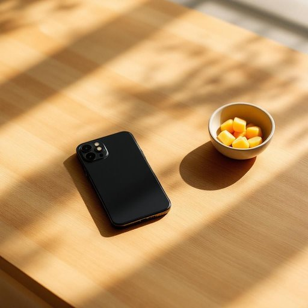

# phone

<h1 style="font-size: 2.5em; font-weight: 300; letter-spacing: 2px; margin: 0; color: #2c3e50;">
/foʊn/
</h1>

---

---

## 例句

Could you please hand me the phone that’s been charging on the kitchen counter next to the fruit bowl, since I need to call Mum and check whether she’s coming over for dinner after the football match ends?

*Could(/kʊd/) you(/ju/) please(/pliz/) hand(/hænd/) me(/mi/) the(/ðə/) phone(/foʊn/) that’s(/that’s*/) been(/bɪn/) charging(/ˈʧɑrʤɪŋ/) on(/ɔn/) the(/ðə/) kitchen(/ˈkɪʧən/) counter(/ˈkaʊntər/) next(/nɛkst/) to(/tɪ/) the(/ðə/) fruit(/frut/) bowl,(/boʊl,/) since(/sɪns/) I(/aɪ/) need(/nid/) to(/tɪ/) call(/kɔl/) Mum(/məm/) and(/ənd/) check(/ʧɛk/) whether(/ˈwɛðər/) she’s(/she’s*/) coming(/ˈkəmɪŋ/) over(/ˈoʊvər/) for(/fər/) dinner(/ˈdɪnər/) after(/ˈæftər/) the(/ðə/) football(/ˈfʊtˌbɔl/) match(/mæʧ/) ends?(/ɛndz?/)*

**翻译：** 你能把正在厨房台面、靠近水果盘边上充着电的手机递给我吗？我需要打电话给妈妈，确认足球赛结束后她是否会过来吃晚饭。

---

## 解释

英语单词“phone”在家居生活用品场景中作为名词，通常指电话设备，包括固定电话或移动电话，主要用于语音通信，具体使用场合多见于家中、办公室等环境，如“在家里接电话”或“桌上放着电话”等日常情境中，学习者应注意“phone”作为名词时是可数名词，常用复数形式“phones”，在表达时常用搭配有“answer the phone”（接电话）、“make a phone call”（打电话）、“phone number”（电话号码）等，此外，“phone”也可用作动词，意为“打电话”，这一点在语法和词义转换上需要留意，词源上，“phone”源自希腊语“phonē”，意为声音，最初与声音相关的设备发展到电话机后被简称为“phone”，在中文语境中，“phone”准确翻译为“电话”，该翻译准确涵盖了其在家居生活用品中的常见含义，没有特殊的褒贬色彩或文化内涵，纯粹为通讯工具名词使用，总的来说，“phone”在家庭生活中是非常常见且实用的词汇，理解其语法特性和常用搭配有助于准确表达和交流。

---

<small style="color: #999; font-size: 0.9em;">2025-07-27 09:14:04</small>

